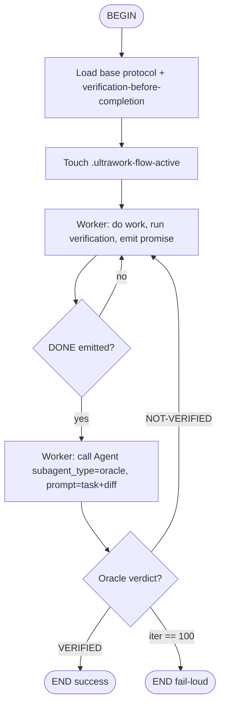

# Ultrawork on Kimi — Native-Path Addendum

**Date:** 2026-05-21
**Owner:** ranwei693532
**Status:** Approved for plan
**Base design:** `2026-05-21-ultrawork-loop-design.md` (this is an addendum, not a replacement)
**Source of inspiration:** kimi-cli v1.43.0 (`src/kimi_cli/hooks/`, `src/kimi_cli/agentspec.py`, `src/kimi_cli/skill/flow/`, `src/kimi_cli/subagents/`)

## Problem

The base Ultrawork design treats Kimi as part of the protocol-only fallback group ("lower assurance — relies on prompt compliance"). Inspection of kimi-cli 1.43.0 shows Kimi already exposes every runtime primitive oh-my-opencode uses to enforce the ralph loop:

- A `Stop` lifecycle hook (`src/kimi_cli/hooks/events.py:stop`) that runs a shell command on assistant end-of-turn and can block + inject a reason via exit code 2.
- Real isolated subagents declared by YAML (`src/kimi_cli/agentspec.py`), dispatched via the `Agent` tool, persisted under `SubagentStore` with their own `Context` and wire log.
- Native flow skills (`/flow:<name>`) whose Mermaid/D2 flowchart is executed by the Soul (`src/kimi_cli/skill/flow/`) — a built-in loop driver that does not depend on Claude Code's `/loop`.

On Kimi we can therefore match oh-my-opencode's runtime guarantee: Worker cannot ship `<promise>DONE</promise>` past a Stop hook that demands an Oracle verdict.

## Goal

Add a Kimi-native primary path to the existing `core/skills/ultrawork/` skill that supersedes the protocol-only fallback **for Kimi only**. Preserve:

- Tag contract (verbatim).
- Iteration cap (100).
- Oracle evidence requirements.
- All 8 base edge cases.

Add:

- A flow skill that drives iterations programmatically.
- A Stop hook that enforces the contract at runtime.
- An Oracle subagent YAML spec, registered into the user's Kimi `agent.yaml`.

## Non-goals (v1)

- Cross-session iteration persistence (matches base design).
- Automated end-to-end runner against a real Kimi model.
- Hot-reload of `config.toml` mid-session (Kimi requires restart for hook config changes — documented).
- Parallel Oracles, model-per-role routing — same deferrals as base design.

## Architecture

This is an addendum that adds a `platforms/kimi/` sub-tree to the planned `core/skills/ultrawork/` skill. The base `SKILL.md` and `platforms.md` gain pointers to the Kimi sub-tree; no other base files change.

```
core/skills/ultrawork/
├── SKILL.md                # base — gains "Platforms → Kimi" pointer
├── oracle.md               # base — shared Oracle prompt requirements
├── protocol.md             # base — tag contract, iteration cap
├── platforms.md            # base — Kimi entry replaced with native pointer
├── tests/                  # base — Scenarios A/B/C
└── platforms/kimi/         # NEW
    ├── README.md           # Install + uninstall + sample config
    ├── flow.md             # /flow:ultrawork — Mermaid flowchart skill
    ├── oracle.yaml         # Oracle subagent spec (extends user default agent)
    ├── oracle.md           # Oracle system prompt (Kimi flavor — uses Kimi tool import paths)
    ├── stop-hook.sh        # Server-side Stop-hook script
    ├── install.sh          # Idempotent installer
    └── tests/              # Kimi-specific exercise scripts K-A..K-F
```

### Module & install surface

- **Module:** `core/` (sibling of `verification-before-completion`).
- **Install:** Kimi-native Ultrawork is **opt-in**, not auto-templated. The base skill SKILL.md + `platforms.md` are still auto-templated by gpowers' Kimi adapter (text-only, harmless). The three side-effecting steps (config.toml hook, agent.yaml subagent registration, hook script copy) only run when the user invokes the opt-in installer (`./install --kimi-ultrawork` or equivalent under gpowers' current CLI surface).
- **Scope:** defaults to project (`./.kimi/`). `--user` flag installs at `~/.kimi/` instead.

### Relationship to base design

| Aspect | Base design | This addendum |
|---|---|---|
| Tag contract | `<promise>DONE</promise>` / `Agent: Oracle\n<promise>VERIFIED</promise>` | Unchanged |
| Iteration cap | 100 | Unchanged (tracked by hook + flow) |
| Oracle evidence requirements | Must cite specific evidence | Unchanged |
| Loop driver on Kimi | Worker self-loop in prompt | `/flow:ultrawork` native flow skill |
| Verification enforcement on Kimi | Prompted self-discipline | Stop hook + flow runner (belt-and-suspenders) |
| Oracle dispatch on Kimi | "If host exposes subagent tool" | YAML spec registered in `agent.yaml`, dispatched via `Agent` tool |

## Components

### Tag contract (verbatim from base design)

- Worker completion: `<promise>DONE</promise>`
- Oracle pass: `Agent: Oracle\n<promise>VERIFIED</promise>`
- Oracle fail: `Agent: Oracle\n<promise>NOT-VERIFIED: <reason></promise>`
- Match regex: `<promise>\s*([^<]+?)\s*</promise>` (case-insensitive)

### Stop-hook script (`stop-hook.sh`)

Reads JSON from stdin per Kimi's hook contract (`src/kimi_cli/hooks/events.py:stop`: `session_id`, `cwd`, `stop_hook_active`). Logic:

1. Locate the session wire log at `${KIMI_SESSION_DIR}/wire.jsonl` (path derivable from `session_id` + Kimi's share dir convention).
2. Check `${KIMI_SESSION_DIR}/.ultrawork-flow-active`. If absent, exit 0 immediately (hook dormant outside `/flow:ultrawork` runs — see edge case 9).
3. Tail wire.jsonl to isolate the last assistant message block (between the most recent `TurnBegin` and `TurnEnd`).
4. Run the case-insensitive promise regex against that block.
5. Branch:
   - No `<promise>` tag → exit 0 (Worker still working).
   - `<promise>DONE</promise>` present AND a matching `Agent: Oracle\n<promise>VERIFIED</promise>` later in the same block → exit 0 (loop ends cleanly).
   - `<promise>DONE</promise>` present, no Oracle verdict yet → exit 2 with stderr reason: `"Ultrawork: emit Oracle verdict before stopping. Dispatch Agent(subagent_type='oracle', prompt=<task + recent diff>)."`
   - `<promise>NOT-VERIFIED: <reason></promise>` present → exit 2 with stderr reason `<reason>`. Soul re-injects as system reminder; loop continues.
6. Iteration counter at `${KIMI_SESSION_DIR}/.ultrawork-iter`: read, increment, write back. At 100, exit 2 with reason `"Ultrawork: iteration cap reached. Aborting loop. See .ultrawork-iter-summary."` and write a per-iteration summary file.

Fail-open behavior is inherited from Kimi (`src/kimi_cli/hooks/runner.py` — timeouts/crashes/missing shell all return `action=allow`). Documented as a known gap with two mitigations: heartbeat log + flow runner second line of defense.

### Oracle subagent spec (`oracle.yaml`)

```yaml
version: 1
agent:
  extend: <resolved-at-install-time-to-user's-default-agent.yaml>
  name: oracle
  when_to_use: |
    Independent verification of Worker's <promise>DONE</promise>.
    Re-runs verification commands; never trusts Worker's pasted output.
    Must cite specific evidence (file paths, test names, command output)
    before emitting the promise tag.
  system_prompt_path: ./oracle.md
  allowed_tools:
    - kimi_cli.tools.shell:Shell
    - kimi_cli.tools.file:ReadFile
    - kimi_cli.tools.file:Glob
    - kimi_cli.tools.file:Grep
  exclude_tools:
    - kimi_cli.tools.file:WriteFile
    - kimi_cli.tools.file:StrReplaceFile
    - kimi_cli.tools.agent:Agent
    - kimi_cli.tools.ask_user:AskUserQuestion
```

The installer registers `oracle:` under the user's `agent.yaml` `subagents:` map between idempotent markers, pointing at `./agents/oracle/oracle.yaml` (relative to `<scope>/.kimi/`).

### Oracle system prompt (`oracle.md`)

Reuses the base design's `oracle.md` content (evidence requirements, NOT-VERIFIED reason format, no recursive subagents). Kimi-specific tweaks:

- Uses Kimi tool names (`Shell`, `ReadFile`, `Glob`, `Grep`) in the prompt examples.
- Mentions `${KIMI_AGENTS_MD}` as the project-instructions source for verification commands.

### Flow skill (`flow.md` → `/flow:ultrawork`)

Mermaid flowchart embedded in SKILL.md, parsed by Kimi's `src/kimi_cli/skill/flow/mermaid.py`. Nodes:



The flow runner owns programmatic dispatch; the Stop hook owns out-of-flow enforcement floor.

### Roles (unchanged from base design)

- **Worker** — user's main Kimi agent. Loads `verification-before-completion`. Runs verification before emitting `<promise>DONE</promise>`.
- **Oracle** — YAML subagent dispatched via the `Agent` tool. Read-only tool surface. Re-runs verification itself. Cites evidence before the verdict tag.
- **Loop driver** — flow runner (primary) + Stop hook (enforcement floor).

## Data flow (one run)

```
User: /flow:ultrawork "fix the failing auth test and verify"
   │
   ▼
[Flow node: load_protocol]
   • Soul loads SKILL.md as user prompt
   • Worker reads protocol + verification-before-completion
   │
   ▼
[Flow node: mark_active]
   • touch ${KIMI_SESSION_DIR}/.ultrawork-flow-active
   │
   ▼
[Flow node: worker_iterate]   ←──────────────────────────┐
   • Worker edits files, runs verification commands       │
   • Pastes verification output in transcript             │
   • Emits <promise>DONE</promise> when green             │
   │                                                       │
   ▼                                                       │
[Soul end-of-turn → Stop event]                            │
   • Stop-hook.sh runs:                                    │
       - Reads last assistant block from wire.jsonl        │
       - Sees <promise>DONE</promise>, no Oracle verdict   │
       - exit 2 with reason "Dispatch Oracle"              │
   • Soul re-injects reason as system reminder             │
   │                                                       │
   ▼                                                       │
[Flow node: dispatch_oracle]                               │
   • Worker calls Agent(subagent_type="oracle",            │
                        prompt=<task + recent diff>)       │
   • Kimi spawns Oracle (own Context, own wire log,        │
     allowlist tools — see oracle.yaml)                    │
   │                                                       │
   ▼                                                       │
[Oracle subagent runs]                                     │
   1. Re-reads original task                               │
   2. Inspects changes (Glob/Grep/ReadFile)                │
   3. Re-runs verification commands itself                 │
   4. Cites specific evidence                              │
   5. Emits final message:                                 │
        Agent: Oracle                                      │
        <promise>VERIFIED</promise>                        │
      or:                                                  │
        Agent: Oracle                                      │
        <promise>NOT-VERIFIED: <reason></promise>          │
   • SubagentStore persists the full Oracle wire log       │
   │                                                       │
   ▼                                                       │
[Flow node: record_verdict — decision]                     │
   • Worker reads Oracle's last message via Agent tool     │
     return value, posts it verbatim into its transcript   │
   ├── <promise>VERIFIED</promise>     → END(success)      │
   ├── <promise>NOT-VERIFIED: ...>     → reason becomes    │
   │       Worker's next-iteration input ─────────────────┘
   └── iter == 100                     → END(fail-loud,
                                          print iter table)
```

**State persistence:**

- Worker state: conversational (Soul `Context`, auto-compacted as usual).
- Oracle state: own `SubagentStore` instance at `session/subagents/<oracle_id>/`, inspectable post-hoc.
- Iteration counter: file at `${KIMI_SESSION_DIR}/.ultrawork-iter`, owned by hook.
- Flow active flag: file at `${KIMI_SESSION_DIR}/.ultrawork-flow-active`, owned by flow runner; removed at END.
- No cross-session persistence in v1 (matches base design).

**Key Kimi-specific invariants:**

1. **Stop hook is the enforcement floor.** Even if the flow runner is bypassed (e.g., user interrupts mid-flow), bare `<promise>DONE</promise>` is still blocked while `.ultrawork-flow-active` exists.
2. **Oracle's `Agent` tool excluded** — no recursive subagents; Oracle cannot delegate verification away.
3. **Worker → Oracle payload = original task + recent diff** (not full transcript) — bounds Oracle prompt size.

## Error handling & edge cases

Base design's 8 cases all apply. Kimi-specific additions:

1. **Hook fail-open behavior.** Kimi's hook runner (`src/kimi_cli/hooks/runner.py`) is fail-open by design — timeouts, crashes, missing shell return `action=allow`. If `stop-hook.sh` crashes (wire.jsonl unreadable, missing `jq`, etc.), the loop *will* exit with an unverified `DONE`. Mitigations:
   - Hook writes a heartbeat to `${KIMI_SESSION_DIR}/.ultrawork-hook.log` per invocation; install validator runs it once with sample input.
   - Flow runner is the second line of defense — it dispatches Oracle programmatically regardless of hook state.
   - Documented gap: "If hook fails silently, you lose enforcement on out-of-flow turns."

2. **User runs `/flow:ultrawork` then interrupts mid-flow.** Kimi's flow runner exits cleanly on user input. Hook stays armed for the rest of the session. `.ultrawork-flow-active` flag remains until next flow start or session end → bare `<promise>DONE</promise>` still blocked. ✅ desired.

3. **`agent.yaml` already has a custom `oracle:` subagent.** Installer parses YAML before writing; if `oracle:` already exists, aborts with: `oracle: key already present in agent.yaml; rename existing or pass --force`. No silent overwrite.

4. **Stop hook fires during normal non-Ultrawork turn.** Hook checks `.ultrawork-flow-active` first; absent → exit 0 immediately. Cost is one `stat` per turn. Acceptable.

5. **Wire log rotation / large session.** Hook tails only the last assistant block (`tac wire.jsonl | awk` until previous `TurnBegin`). Bounded regardless of session size.

6. **Oracle subagent can't find verification commands.** Oracle's prompt mandates reading `AGENTS.md` / `${KIMI_AGENTS_MD}`; if still unknown, emits `NOT-VERIFIED: verification commands undiscoverable — Worker must declare them in next iteration`. Loop continues with Worker re-stating commands explicitly.

7. **Iteration counter file missing/corrupted.** Hook treats missing as `iter=0`; non-integer as `iter=0` with warning to heartbeat log. Never crashes the loop.

8. **ACP mode (Kimi as ACP server for IDEs).** Same server-side hook fires regardless of UI — confirmed via `events.py:stop` (UI-agnostic). ✅ works in Zed/JetBrains.

9. **Hook dormancy outside flow runs.** Hook reads `.ultrawork-flow-active`; absent → exit 0. Trade-off: out-of-flow `<promise>DONE</promise>` is not blocked. Rationale: prevents the hook from interfering with users who happen to write `<promise>` literally in unrelated conversations. Documented in `platforms/kimi/README.md`.

10. **Uninstall doesn't clean session dir state.** `.ultrawork-iter`, `.ultrawork-flow-active`, `.ultrawork-hook.log` stay in old session dirs after uninstall. Documented; not worth a cleanup pass.

11. **`extend:` path resolution in `oracle.yaml` at install time.** Installer resolves `<scope>/.kimi/agent.yaml` (or builtin default if no project agent.yaml) and writes the absolute path into `oracle.yaml`'s `extend:` field. Re-runs of the installer re-resolve, so moving the user's agent.yaml requires re-install. Documented.

## Testing

Skill ships content + an installer script + a hook script. Tests = spec validation + manual exercises + install regression.

### Spec-embedded examples in `platforms/kimi/README.md`

- Sample `config.toml` Stop-hook entry between markers `# >>> gpowers:ultrawork >>>` / `# <<< gpowers:ultrawork <<<`.
- Sample `oracle:` entry inside `agent.yaml`'s `subagents:` map.
- Sample wire.jsonl excerpt showing what the hook script parses.

### Manual exercise scripts in `core/skills/ultrawork/platforms/kimi/tests/`

| Scenario | Setup | Expect |
|---|---|---|
| **K-A — happy path** | `/flow:ultrawork "add function double(x) + test"` | 1 Worker iter → Oracle VERIFIED → END(success); `.ultrawork-iter == 1` |
| **K-B — premature DONE via hook** | During an active flow run, paste bare `<promise>DONE</promise>` without verification | Hook exits 2; reason injected; Worker forced to dispatch Oracle |
| **K-C — hook fail-open** | Rename `stop-hook.sh` mid-session; type bare `<promise>DONE</promise>` outside flow | Hook fail-open → exit 0; flow runner not active, so DONE accepted. Documents gap. |
| **K-D — Oracle isolation** | Run K-A, then inspect `session/subagents/<oracle_id>/` | Oracle has own Context, own wire log, no Worker chat history |
| **K-E — install/uninstall idempotency** | Run installer twice; uninstall; install again | No duplicate `config.toml` entries; no duplicate `oracle:` keys; uninstall leaves `agent.yaml` clean |
| **K-F — ACP mode smoke** | `kimi acp` driven by stub ACP client; run K-A | Same exit conditions as terminal mode |

### Install regression

`./install --kimi-ultrawork` on a clean project. Confirm:

- `.kimi/skills/ultrawork/SKILL.md` written
- `.kimi/agents/oracle/{oracle.yaml,oracle.md}` written
- `.kimi/hooks/ultrawork-stop.sh` executable
- `.kimi/config.toml` contains exactly one block between markers
- `.kimi/agent.yaml` has exactly one `oracle:` key under `subagents:`

### Cross-platform regression

Base design's Scenarios A/B/C still pass on Claude Code and at least one fallback host. Adding the Kimi path must not change behavior on other platforms.

### Not in v1

- Automated runner driving a real Kimi model end-to-end (deferred to a benchmark extension).
- Multi-session iteration counter (per-session reset is acceptable).
- Hot-reload of `config.toml` mid-session (Kimi requires restart — documented).

## Open questions / risks

- **Fail-open hook on Kimi means runtime guarantee is weaker than oh-my-opencode's plugin hook.** oh-my-opencode aborts the agent loop on plugin-hook crash; Kimi's hook runner allows on crash. Mitigation: flow runner second line + heartbeat log. Accept residual risk for v1.
- **`extend:` path absolutization** ties `oracle.yaml` to install location. Re-installing after moving the project breaks it. Reinstall is the documented workaround.
- **Hook dormancy** (#9) means out-of-flow `<promise>DONE</promise>` slips through. Alternative would be always-on hook, but that risks interfering with non-Ultrawork transcripts that happen to contain `<promise>`. The trade-off is conscious.

## Out of scope — escalated to roadmap

Other features from kimi-cli (flow skills as a general gpowers primitive, server-side hooks as a gpowers-managed config layer, agent-spec YAML as a per-platform extension surface) belong in `2026-05-21-oh-my-opencode-port-roadmap.md` and a future kimi-cli port roadmap. This addendum is narrowly about strengthening Ultrawork on Kimi.
