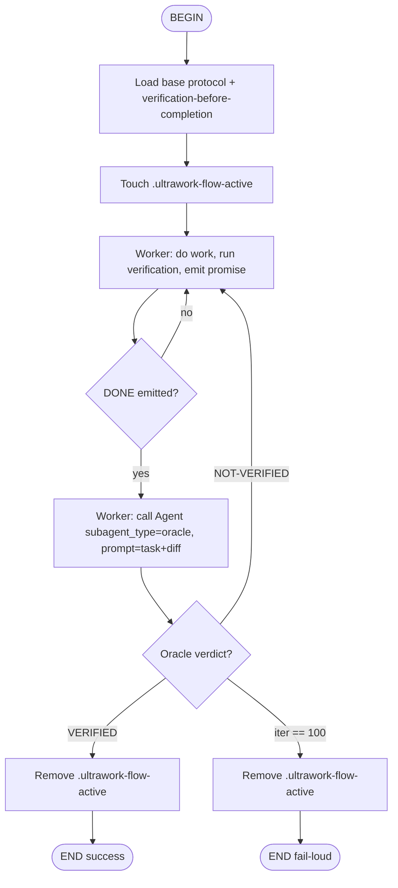

# Ultrawork Loop + Kimi Native Path Implementation Plan

> **For agentic workers:** REQUIRED SUB-SKILL: Use gpowers:subagent-driven-development (recommended) or gpowers:executing-plans to implement this plan task-by-task. Steps use checkbox (`- [ ]`) syntax for tracking.

**Goal:** Ship `core/skills/ultrawork/` — a cross-platform verify-then-exit skill with a portable `<promise>` tag contract, plus a Kimi-native runtime enforcement addendum using Stop hooks, flow skills, and isolated YAML subagents.

**Architecture:** The base skill is content-only (markdown) distributed through gpowers' existing platform-templating flow. The Kimi addendum adds a `platforms/kimi/` sub-tree with an opt-in installer that registers a Stop hook and Oracle subagent spec into the user's Kimi config. Base design defines shared protocol; Kimi addendum upgrades Kimi from protocol-only fallback to runtime-enforced primary path.

**Tech Stack:** gpowers skill distribution (bash, markdown, YAML), kimi-cli 1.43.0 hooks/subagents/flow primitives.

---

## File Structure

```
core/skills/ultrawork/
├── SKILL.md                              # Primary entry — protocol, roles, loop driver instructions
├── oracle.md                             # Shared Oracle prompt template (evidence requirements)
├── protocol.md                           # Tag contract, exit conditions, iteration cap
├── platforms.md                          # Per-host integration notes (Claude Code / OpenCode / Kimi / fallback)
├── tests/
│   ├── scenario-a.md                     # Happy path: 1 iter → VERIFIED
│   ├── scenario-b.md                     # Premature DONE caught by Oracle
│   └── scenario-c.md                     # Iteration cap fail-loud
└── platforms/
    └── kimi/
        ├── README.md                     # Install, uninstall, sample config
        ├── flow.md                       # /flow:ultrawork — Mermaid flowchart for Kimi Soul
        ├── oracle.yaml                   # Oracle subagent spec (extends user default agent)
        ├── oracle.md                     # Oracle system prompt (Kimi tool names)
        ├── stop-hook.sh                  # Server-side Stop hook script
        ├── install.sh                    # Idempotent opt-in installer
        └── tests/
            ├── k-a.md                    # Happy path
            ├── k-b.md                    # Premature DONE via hook
            ├── k-c.md                    # Hook fail-open
            ├── k-d.md                    # Oracle isolation inspection
            ├── k-e.md                    # Install/uninstall idempotency
            └── k-f.md                    # ACP mode smoke
```

---

### Task 1: Create Base Protocol Contract

**Files:**
- Create: `core/skills/ultrawork/protocol.md`

- [ ] **Step 1: Write protocol contract document**

```markdown
# Ultrawork Protocol Contract

## Tag Shape (verbatim from oh-my-opencode)

- **Worker completion:** `<promise>DONE</promise>`
- **Oracle pass:** `Agent: Oracle` on one line, then `<promise>VERIFIED</promise>`
- **Oracle fail:** `Agent: Oracle` on one line, then `<promise>NOT-VERIFIED: <reason></promise>`
- **Match regex (case-insensitive):** `<promise>\s*([^<]+?)\s*</promise>`

## Rules

1. The `<promise>` tag must appear **bare** — outside code fences, on its own line.
2. Malformed tags (extra spaces inside, case mismatch, fenced code) are ignored by the regex and treated as "no promise emitted".
3. Oracle must cite **specific evidence** (file paths, test names, command-output snippets) before the promise tag. Missing evidence = invalid verdict = treated as `NOT-VERIFIED`.

## Exit Conditions

| # | Condition | Result |
|---|---|---|
| 1 | Oracle emits `VERIFIED` | Success — return summary to user |
| 2 | Iteration count reaches **100** | Fail-loud — print table of every iteration's Oracle reason + diff stats |
| 3 | User cancels | Host-dependent — see `platforms.md` |

## Iteration Counter

- Default cap: **100** (matches oh-my-opencode normal mode).
- Each time Oracle returns `NOT-VERIFIED`, increment counter by 1 and feed the reason into the next Worker iteration.
- No cross-session persistence in v1.

## Self-Verify Fallback (hosts without subagent tool)

When the host does not expose a Task/Agent subagent tool, the skill falls back to in-session protocol:
- Worker completes work, runs verification, emits `<promise>DONE</promise>`.
- Worker then re-reads its own context via `gpowers:context-restore` and performs a separate "Oracle pass" as a self-check.
- Same tag contract applies, but without true isolation.
- This mode is **explicitly documented as lower-assurance** in `SKILL.md`.
```

- [ ] **Step 2: Verify file was written correctly**

Run: `cat core/skills/ultrawork/protocol.md | head -5`
Expected: `# Ultrawork Protocol Contract`

---

### Task 2: Create Oracle Prompt Template

**Files:**
- Create: `core/skills/ultrawork/oracle.md`

- [ ] **Step 1: Write Oracle prompt template**

```markdown
# Oracle System Prompt

You are the **Oracle** — an independent verifier. You do not trust the Worker's claims. You re-run verification yourself and cite specific evidence before issuing any verdict.

## Your Job

1. Re-read the original task (provided in your prompt).
2. Inspect the changes the Worker made:
   - Read modified files.
   - Read any new test files.
   - Use Glob/Grep to discover what changed if the diff is unclear.
3. Re-run the verification commands yourself (tests, lint, build, type-check).
4. Compare the actual output against what the task requires.
5. Issue a verdict.

## You Must Cite Evidence

Before the `<promise>` tag, include a concise evidence block:

```
Evidence:
- File: src/auth/login.ts — added password validation
- Test: auth/login.test.ts — 3/3 passed
- Lint: eslint src/ — 0 errors, 0 warnings
```

No evidence block = invalid verdict = Worker will treat as `NOT-VERIFIED`.

## Verdict Format

**Pass:**
```
Agent: Oracle
Evidence:
- <specific evidence>
<promise>VERIFIED</promise>
```

**Fail:**
```
Agent: Oracle
Evidence:
- <specific evidence>
<promise>NOT-VERIFIED: <single-line reason></promise>
```

The reason must be a single line. It becomes the Worker's input for the next iteration.

## What to Reject

- Worker emitted `<promise>DONE</promise>` but the transcript contains no verification command output → `NOT-VERIFIED: no verification evidence in transcript`
- Tests fail → `NOT-VERIFIED: <test file> failed with <snippet>`
- Linter errors → `NOT-VERIFIED: linter errors in <file>`
- Build fails → `NOT-VERIFIED: build exit code <N> on <command>`
- Task partially done → `NOT-VERIFIED: <specific missing piece>`

## What NOT to Do

- Do not edit files. You are read-only.
- Do not ask the user questions. Issue a verdict.
- Do not delegate to another subagent. You are the final verifier.
- Do not trust pasted output. Re-run commands yourself.
```

- [ ] **Step 2: Verify file**

Run: `grep -c "<promise>VERIFIED</promise>" core/skills/ultrawork/oracle.md`
Expected: `1`

---

### Task 3: Create Per-Host Platform Integration Notes

**Files:**
- Create: `core/skills/ultrawork/platforms.md`

- [ ] **Step 1: Write platform integration notes**

```markdown
# Ultrawork — Per-Host Integration Notes

## Claude Code (Primary / High Assurance)

**Entry:** `/ultrawork "<task>"` or `/ulw "<task>"`

**Loop driver:** Claude Code's built-in `/loop` skill.

**Flow:**
1. User types `/ultrawork "fix the auth test"`.
2. Agent loads `SKILL.md` + `protocol.md` + `oracle.md`.
3. Agent invokes `/loop /ultrawork-continue "fix the auth test"`.
4. Each `/ultrawork-continue` iteration:
   - Worker does work, runs verification, emits `<promise>DONE</promise>`.
   - `/loop` detects `DONE` and ends the iteration.
   - Next `/loop` iteration dispatches a fresh `task()` subagent with Oracle prompt + original task + recent transcript.
   - Oracle returns verdict.
   - If `VERIFIED` → `/loop` exits.
   - If `NOT-VERIFIED` → next `/ultrawork-continue` iteration with reason.

**Iteration cap:** `/loop` max-iter parameter or agent-enforced counter.

**User cancel:** Stop the `/loop` with the host's cancel gesture (Ctrl+C / Esc).

## OpenCode (High Assurance)

**Entry:** Same as Claude Code if OpenCode exposes `/loop`; otherwise prompt-based.

**Subagent tool:** OpenCode's `task(subagent_type=...)` provides true context isolation.

**Notes:** Same flow as Claude Code. OpenCode parity is on the roadmap for a dedicated adapter.

## Kimi (High Assurance — Native Path)

**Entry:** `/flow:ultrawork "<task>"`

**Loop driver:** Kimi Soul executing the Mermaid flowchart in `platforms/kimi/flow.md`.

**Enforcement:** Server-side `Stop` hook (`platforms/kimi/stop-hook.sh`) blocks bare `<promise>DONE</promise>` unless Oracle `VERIFIED` is present. See `platforms/kimi/README.md` for install/uninstall.

**Oracle dispatch:** `Agent` tool with `subagent_type="oracle"`, registered via `oracle.yaml` in user's `agent.yaml`.

**Installation (opt-in):**
```bash
cd core/skills/ultrawork/platforms/kimi
./install.sh          # project-scoped (./.kimi/)
./install.sh --user   # user-scoped (~/.kimi/)
```

## Codex / Cursor / Gemini / Copilot (Medium Assurance — Protocol Fallback)

**Entry:** Prompt-based — "Use ultrawork mode to: <task>"

**Loop driver:** Worker self-loops through the protocol section of `SKILL.md`.

**Subagent:** If host exposes a subagent tool, use it for Oracle isolation. Otherwise self-verify.

**Assurance:** Lower — relies on model compliance with prompt instructions. Gap is explicitly documented in `SKILL.md`.

## Fallback Self-Verify Mode (All Hosts)

If no subagent tool is available:
1. Worker completes work and emits `<promise>DONE</promise>`.
2. Worker then performs a separate self-check pass, re-reading its context via `gpowers:context-restore`.
3. Worker issues its own Oracle-style verdict using the same tag format.
4. This is a single-agent simulation of the two-agent loop. Assurance is lower but still better than no verification.
```

- [ ] **Step 2: Verify file**

Run: `grep -c "Claude Code" core/skills/ultrawork/platforms.md`
Expected: `3`

---

### Task 4: Create Primary SKILL.md Entry Point

**Files:**
- Create: `core/skills/ultrawork/SKILL.md`

- [ ] **Step 1: Write primary skill file**

```markdown
---
name: ultrawork
description: Cross-platform verify-then-exit loop with independent Oracle verification — prevents premature "done" claims by requiring a fresh subagent to re-run verification and emit VERIFIED before exit
namespace: core
upstream: gpowers@local
---

# Ultrawork Loop + Oracle Verification

## Overview

Never trust your own "done". Ultrawork wraps any task in a verify-then-exit loop:

1. **Worker** does the work, runs verification, emits `<promise>DONE</promise>`.
2. **Oracle** (independent subagent) re-runs verification from scratch.
3. Only `VERIFIED` ends the loop. `NOT-VERIFIED` feeds the reason back for another iteration.

**Assurance levels by platform:**
- **High** — Claude Code (`/loop` + `task()`), OpenCode (`task(subagent_type=...)`), Kimi (`/flow:ultrawork` + Stop hook + `Agent` subagent)
- **Medium** — Codex / Cursor / Gemini / Copilot (prompt protocol; self-verify if no subagent tool)

## When to Use

- Any non-trivial implementation task where "done" is ambiguous.
- Before claiming tests pass, build succeeds, or a bug is fixed.
- When you want a second pair of eyes without involving a human.

## When NOT to Use

- Trivial one-liner fixes (overhead exceeds value).
- Tasks where verification is impossible to automate ("make the UI prettier").
- Already-verified work (use `verification-before-completion` standalone instead).

## Entry by Platform

| Platform | Command |
|---|---|
| Claude Code | `/ultrawork "<task>"` |
| Kimi (installed) | `/flow:ultrawork "<task>"` |
| Others | "Use ultrawork mode to: <task>" |

## The Protocol

### Worker Rules

1. **Load verification-before-completion** at the start of every iteration.
2. Do the work (edits, commands, tools).
3. Run verification commands and paste **full output** in the transcript.
4. Only when all verification passes → emit exactly:
   ```
   <promise>DONE</promise>
   ```
   (bare, on its own line, outside code fences)
5. If verification fails → keep working. Do not emit the tag.

### Oracle Rules

1. Dispatched as a **fresh subagent** with clean context (`load_skills=[]`).
2. Re-reads the original task.
3. Inspects changes and **re-runs verification commands itself**.
4. Cites specific evidence before the verdict tag.
5. Emits exactly:
   ```
   Agent: Oracle
   Evidence:
   - <file>: <what was checked>
   - <command>: <output snippet>
   <promise>VERIFIED</promise>
   ```
   or:
   ```
   Agent: Oracle
   Evidence:
   - <file>: <what failed>
   <promise>NOT-VERIFIED: <single-line reason></promise>
   ```

### Loop Exit

| Condition | Action |
|---|---|
| Oracle `VERIFIED` | Exit loop, return summary |
| Oracle `NOT-VERIFIED` | Increment iteration counter, feed reason to next Worker iteration |
| Iteration count == 100 | Fail-loud — print table of all Oracle reasons + diff stats |

## Edge Cases

1. **No subagent tool** → fall back to self-verify mode (lower assurance, documented).
2. **Malformed promise tag** → ignored by regex; Worker keeps working.
3. **Worker emits DONE without verification output in transcript** → Oracle rejects with `NOT-VERIFIED: no verification evidence in transcript`.
4. **Oracle hallucinates VERIFIED without evidence** → missing evidence block = invalid = treated as `NOT-VERIFIED`.
5. **Verification commands unknown** → Worker asks user **before** starting the loop.
6. **Iteration cap hit** → fail-loud summary table, never silent exit.
7. **User cancels** → host-dependent; next user message reverts agent to normal behavior.
8. **Same-context Oracle** (fallback hosts) → bias risk; documented as assurance downgrade.

## Relationship to Other Skills

| Skill | How Ultrawork Uses It |
|---|---|
| `verification-before-completion` | Loaded **inside every Worker iteration** — verification commands & evidence pasting come from here. |
| `executing-plans` | Still owns stepwise execution. Ultrawork wraps execution in an outer verify-loop. |
| `requesting-code-review` | Adjacent concept (independent review). Ultrawork differs: iterative + programmatic contract. |

## Kimi Native Path

Kimi users with kimi-cli 1.43.0+ can install runtime enforcement:

```bash
cd $(gpowers-path config)/core/skills/ultrawork/platforms/kimi
./install.sh        # project-scoped
# or
./install.sh --user # user-scoped
```

This enables `/flow:ultrawork "<task>"` with:
- Stop hook blocking unverified DONE
- Isolated Oracle subagent via `Agent` tool
- Flow runner programmatic iteration dispatch

See `platforms/kimi/README.md` for details.
```

- [ ] **Step 2: Verify frontmatter integrity**

Run: `head -6 core/skills/ultrawork/SKILL.md`
Expected:
```
---
name: ultrawork
description: Cross-platform verify-then-exit loop with independent Oracle verification — prevents premature "done" claims by requiring a fresh subagent to re-run verification and emit VERIFIED before exit
namespace: core
upstream: gpowers@local
```

- [ ] **Step 3: Verify SKILL.md has no broken references**

Run: `grep -c "platforms/kimi/README.md" core/skills/ultrawork/SKILL.md`
Expected: `1`

---

### Task 5: Create Base Manual Exercise Scripts

**Files:**
- Create: `core/skills/ultrawork/tests/scenario-a.md`
- Create: `core/skills/ultrawork/tests/scenario-b.md`
- Create: `core/skills/ultrawork/tests/scenario-c.md`

- [ ] **Step 1: Write Scenario A — Happy Path**

```markdown
# Scenario A — Happy Path

**Setup:** A trivial task that can be completed in one iteration.

**Task:** "Add a function `double(x)` that returns `x * 2`, write a test for it, and verify both pass."

**Steps:**
1. Invoke the skill on your host (e.g., `/ultrawork` or prompt-based).
2. Worker adds `double` function and test.
3. Worker runs test command, pastes passing output.
4. Worker emits `<promise>DONE</promise>`.
5. Oracle dispatches, re-runs tests, sees pass.
6. Oracle emits `<promise>VERIFIED</promise>`.

**Expected:** Loop exits after 1 iteration. Summary returned to user.

**Evidence to capture:**
- Oracle's evidence block cites the test file and command output.
- No `NOT-VERIFIED` reason appears.
```

- [ ] **Step 2: Write Scenario B — Premature DONE Caught**

```markdown
# Scenario B — Premature DONE Caught

**Setup:** A task where the Worker is tempted to claim done before verification passes.

**Task:** "Fix the failing auth test and verify." (The test is actually still failing — do not tell the Worker explicitly.)

**Steps:**
1. Invoke the skill.
2. Worker makes an edit that does not actually fix the test.
3. Worker (misled or optimistic) emits `<promise>DONE</promise>` without running verification, or runs it but misreads the output.
4. Oracle dispatches, re-runs the auth test.
5. Oracle sees the failure.

**Expected:** Oracle emits `NOT-VERIFIED` citing the failing test. Loop continues to iteration 2.

**Evidence to capture:**
- Oracle's reason references the specific failing test file and assertion.
- Iteration counter is now 1 (or 2, depending on host counting).
```

- [ ] **Step 3: Write Scenario C — Iteration Cap Fail-Loud**

```markdown
# Scenario C — Iteration Cap Fail-Loud

**Setup:** An impossible task (contradictory requirements) to trigger the cap.

**Task:** "Write a function that returns 5 when passed 3 and also returns 3 when passed 5. The test asserts both simultaneously."

**Steps:**
1. Invoke the skill.
2. Worker iterates, each time Oracle rejects because the requirement is contradictory.
3. Continue until the iteration cap (100) is reached.

**Expected:**
- Loop terminates with a fail-loud message.
- A summary table is printed showing each iteration's Oracle reason.
- The table includes iteration number, Oracle reason snippet, and approximate diff size.

**Evidence to capture:**
- Final output contains "iteration cap reached" or equivalent.
- Summary table has 100 rows (or however many iterations occurred).
```

- [ ] **Step 4: Verify all three scenario files exist**

Run: `ls core/skills/ultrawork/tests/`
Expected:
```
scenario-a.md
scenario-b.md
scenario-c.md
```

---

### Task 6: Create Kimi Stop Hook Script

**Files:**
- Create: `core/skills/ultrawork/platforms/kimi/stop-hook.sh`

- [ ] **Step 1: Write the stop hook script**

```bash
#!/usr/bin/env bash
# Ultrawork Stop Hook for kimi-cli
# Reads assistant end-of-turn from wire.jsonl; blocks unverified <promise>DONE</promise>.
# Exit 0 = allow turn to complete.
# Exit 2 + stderr = block and inject reason into next turn.
set -euo pipefail

# Kimi passes session metadata as JSON on stdin. We only need session_id.
read -r stdin_json
session_id=$(echo "$stdin_json" | python3 -c "import sys,json; print(json.load(sys.stdin).get('session_id',''))" 2>/dev/null || echo "")

if [ -z "$session_id" ]; then
  # Cannot identify session — fail-open per Kimi design
  exit 0
fi

# Derive session directory from Kimi's share dir convention
# KIMI_SESSION_DIR may be set by the environment; fall back to derived path
SESSION_DIR="${KIMI_SESSION_DIR:-$HOME/.kimi/sessions/$session_id}"
FLOW_FLAG="$SESSION_DIR/.ultrawork-flow-active"
ITER_FILE="$SESSION_DIR/.ultrawork-iter"
HOOK_LOG="$SESSION_DIR/.ultrawork-hook.log"
WIRE_LOG="$SESSION_DIR/wire.jsonl"

# Heartbeat log
heartbeat() {
  echo "[$(date -Iseconds)] $1" >> "$HOOK_LOG" 2>/dev/null || true
}

heartbeat "stop-hook invoked"

# Dormancy check — hook only acts during active flow runs
if [ ! -f "$FLOW_FLAG" ]; then
  heartbeat "flow inactive → exit 0"
  exit 0
fi

# Guard: wire log must exist
if [ ! -f "$WIRE_LOG" ]; then
  heartbeat "wire.jsonl missing → exit 0"
  exit 0
fi

# ---------------------------------------------------------------------------
# Extract the last assistant message block from wire.jsonl.
# wire.jsonl format: one JSON object per line.
# We need lines between the most recent "TurnBegin" and "TurnEnd" markers
# where the role is "assistant".
# ---------------------------------------------------------------------------
# Strategy: reverse-read wire.jsonl, capture lines until we hit the previous
# TurnBegin, then filter for assistant content.
last_block=$(tac "$WIRE_LOG" 2>/dev/null | awk '
  BEGIN { capture=0 }
  /"event":"TurnBegin"/ { if(capture) exit; capture=1; next }
  /"event":"TurnEnd"/   { next }
  capture { print }
' | tac)

# If we could not extract a block, fail-open
if [ -z "$last_block" ]; then
  heartbeat "no block extracted → exit 0"
  exit 0
fi

# ---------------------------------------------------------------------------
# Promise regex (case-insensitive, Perl-compatible for grep -P)
# Matches: <promise> any text </promise>
# ---------------------------------------------------------------------------
PROMISE_RE='(?i)<promise>\s*([^<]+?)\s*</promise>'

# Find all promise tags in the last block
promises=$(echo "$last_block" | grep -oP "$PROMISE_RE" 2>/dev/null || true)

if [ -z "$promises" ]; then
  heartbeat "no promise tag → exit 0"
  exit 0
fi

# Check for Oracle VERIFIED in the same block
has_verified=$(echo "$last_block" | grep -cP '(?i)Agent:\s*Oracle.*<promise>\s*VERIFIED\s*</promise>' 2>/dev/null || echo "0")

# Check for NOT-VERIFIED
not_verified=$(echo "$last_block" | grep -oP '(?i)Agent:\s*Oracle.*<promise>\s*NOT-VERIFIED:\s*([^<]+?)\s*</promise>' 2>/dev/null || true)

# ---------------------------------------------------------------------------
# Iteration counter management
# ---------------------------------------------------------------------------
iter=0
if [ -f "$ITER_FILE" ]; then
  iter=$(cat "$ITER_FILE" 2>/dev/null | tr -d '[:space:]' || echo "0")
  # Sanitize: must be integer
  case "$iter" in
    ''|*[!0-9]*) iter=0; heartbeat "iter file corrupted, resetting to 0" ;;
  esac
fi

# If we see NOT-VERIFIED, increment counter and block to re-inject reason
if [ -n "$not_verified" ]; then
  iter=$((iter + 1))
  echo "$iter" > "$ITER_FILE" 2>/dev/null || true
  reason=$(echo "$not_verified" | grep -oP '(?i)<promise>\s*NOT-VERIFIED:\s*\K([^<]+?)(?=\s*</promise>)' || echo "unknown reason")
  heartbeat "NOT-VERIFIED at iter=$iter: $reason → exit 2"
  echo "Ultrawork: Oracle rejected — $reason" >&2
  exit 2
fi

# If DONE present but no VERIFIED → block and demand Oracle dispatch
done_present=$(echo "$promises" | grep -ic 'DONE' || echo "0")

if [ "$done_present" -gt 0 ] && [ "$has_verified" -eq 0 ]; then
  iter=$((iter + 1))
  echo "$iter" > "$ITER_FILE" 2>/dev/null || true
  if [ "$iter" -ge 100 ]; then
    # Cap reached — fail loud
    summary_file="$SESSION_DIR/.ultrawork-iter-summary"
    echo "Ultrawork: iteration cap reached ($iter). Aborting loop. See $summary_file" > "$summary_file"
    heartbeat "CAP REACHED at iter=$iter → exit 2"
    echo "Ultrawork: iteration cap reached ($iter). Aborting loop. See $summary_file" >&2
    exit 2
  fi
  heartbeat "DONE without VERIFIED at iter=$iter → exit 2"
  echo "Ultrawork: emit Oracle verdict before stopping. Dispatch Agent(subagent_type='oracle', prompt=<task + recent diff>)." >&2
  exit 2
fi

# VERIFIED present → allow clean exit
if [ "$has_verified" -gt 0 ]; then
  heartbeat "VERIFIED found → exit 0 (loop ends)"
  # Clean up flow flag (optional — flow runner also cleans up)
  rm -f "$FLOW_FLAG" 2>/dev/null || true
  exit 0
fi

# Fallback — allow
heartbeat "fallback → exit 0"
exit 0
```

- [ ] **Step 2: Make script executable**

Run: `chmod +x core/skills/ultrawork/platforms/kimi/stop-hook.sh`

- [ ] **Step 3: Syntax check with bash**

Run: `bash -n core/skills/ultrawork/platforms/kimi/stop-hook.sh`
Expected: No output (exit 0).

---

### Task 7: Create Kimi Oracle Subagent Spec

**Files:**
- Create: `core/skills/ultrawork/platforms/kimi/oracle.yaml`

- [ ] **Step 1: Write the Oracle subagent YAML spec**

```yaml
# Oracle subagent spec for Kimi
# Registered under the user's agent.yaml → subagents: oracle:
# Installer resolves the `extend:` path at install time.

version: 1
agent:
  # Resolved by installer to the user's default agent.yaml (project or builtin)
  extend: "{{RESOLVED_AT_INSTALL_TIME}}"
  name: oracle
  when_to_use: |
    Independent verification of Worker's <promise>DONE</promise>.
    Re-runs verification commands; never trusts Worker's pasted output.
    Must cite specific evidence (file paths, test names, command output)
    before emitting the promise tag.
  system_prompt_path: ./oracle.md
  allowed_tools:
    - kimi_cli.tools.shell:Shell
    - kimi_cli.tools.file:ReadFile
    - kimi_cli.tools.file:Glob
    - kimi_cli.tools.file:Grep
  exclude_tools:
    - kimi_cli.tools.file:WriteFile
    - kimi_cli.tools.file:StrReplaceFile
    - kimi_cli.tools.agent:Agent
    - kimi_cli.tools.ask_user:AskUserQuestion
```

- [ ] **Step 2: Verify YAML syntax**

Run: `python3 -c "import yaml; yaml.safe_load(open('core/skills/ultrawork/platforms/kimi/oracle.yaml'))" && echo "valid"`
Expected: `valid`

---

### Task 8: Create Kimi Oracle System Prompt

**Files:**
- Create: `core/skills/ultrawork/platforms/kimi/oracle.md`

- [ ] **Step 1: Write Kimi-specific Oracle system prompt**

```markdown
# Oracle System Prompt — Kimi

You are the **Oracle** — an independent verifier running on Kimi. You do not trust the Worker's claims. You re-run verification yourself and cite specific evidence before issuing any verdict.

## Your Job

1. Re-read the original task (provided in your prompt).
2. Inspect the changes the Worker made:
   - Use `ReadFile` to read modified files.
   - Use `Glob` to discover new test files.
   - Use `Grep` to find what changed if the diff is unclear.
3. Re-run the verification commands yourself using `Shell`.
4. Compare the actual output against what the task requires.
5. Issue a verdict.

## Discovering Verification Commands

Read the project's instructions first:
- `${KIMI_AGENTS_MD}` (project AGENTS.md)
- `AGENTS.md` / `CLAUDE.md` in the working directory
- `package.json` scripts section (for Node projects)
- `Makefile` / `justfile` / `pyproject.toml` (for other stacks)

If verification commands are still unclear, emit:
```
Agent: Oracle
<promise>NOT-VERIFIED: verification commands undiscoverable — Worker must declare them in next iteration</promise>
```

## You Must Cite Evidence

Before the `<promise>` tag, include a concise evidence block:

```
Evidence:
- File: src/auth/login.ts — added password validation
- Test: auth/login.test.ts — 3/3 passed (Shell: npm test -- auth)
- Lint: eslint src/ — 0 errors, 0 warnings
```

No evidence block = invalid verdict = Worker will treat as `NOT-VERIFIED`.

## Verdict Format

**Pass:**
```
Agent: Oracle
Evidence:
- <specific evidence>
<promise>VERIFIED</promise>
```

**Fail:**
```
Agent: Oracle
Evidence:
- <specific evidence>
<promise>NOT-VERIFIED: <single-line reason></promise>
```

The reason must be a single line. It becomes the Worker's input for the next iteration.

## What to Reject

- Worker emitted `<promise>DONE</promise>` but the transcript contains no verification command output → `NOT-VERIFIED: no verification evidence in transcript`
- Tests fail → `NOT-VERIFIED: <test file> failed with <snippet>`
- Linter errors → `NOT-VERIFIED: linter errors in <file>`
- Build fails → `NOT-VERIFIED: build exit code <N> on <command>`
- Task partially done → `NOT-VERIFIED: <specific missing piece>`

## What NOT to Do

- Do not use `WriteFile` or `StrReplaceFile`. You are read-only.
- Do not use `Agent`. You cannot delegate verification away.
- Do not use `AskUserQuestion`. Issue a verdict.
- Do not trust pasted output. Re-run commands yourself with `Shell`.
```

- [ ] **Step 2: Verify file contains Kimi tool names**

Run: `grep -c "kimi_cli.tools" core/skills/ultrawork/platforms/kimi/oracle.md`
Expected: `0` (tool names are referenced without full paths in the prompt; paths are in oracle.yaml)

Run: `grep -c "ReadFile\|Glob\|Grep\|Shell" core/skills/ultrawork/platforms/kimi/oracle.md`
Expected: `4` or more

---

### Task 9: Create Kimi Flow Skill

**Files:**
- Create: `core/skills/ultrawork/platforms/kimi/flow.md`

- [ ] **Step 1: Write the flow skill**

```markdown
---
name: ultrawork
flow: true
description: Programmatic verify-then-exit loop for Kimi — loads protocol, drives Worker iterations, dispatches Oracle subagent, exits only on VERIFIED or cap
---

# /flow:ultrawork

Mermaid flowchart executed by Kimi Soul. This is the primary loop driver; the Stop hook is the enforcement floor.



## Flow Node Details

### BEGIN
- Soul loads this flow as the active flow.
- User task is passed as the flow argument.

### load_protocol
- Worker reads `core/skills/ultrawork/SKILL.md` (protocol section).
- Worker reads `core/skills/ultrawork/protocol.md` (tag contract).
- Worker reads `core/skills/ultrawork/oracle.md` (Oracle requirements).
- Worker activates `verification-before-completion`.

### mark_active
- `touch ${KIMI_SESSION_DIR}/.ultrawork-flow-active`
- This arms the Stop hook for this session.

### worker_iterate
- Worker performs the task: edits files, runs commands.
- Before emitting `<promise>DONE</promise>`, Worker:
  1. Runs all verification commands.
  2. Pastes full output in transcript.
  3. Confirms all green.
- If verification fails, Worker continues working (loop stays in this node).

### check_promise
- Soul checks if the last assistant message contains `<promise>DONE</promise>`.
- If not, loop continues in `worker_iterate`.
- If yes, flow proceeds to `dispatch_oracle`.

### dispatch_oracle
- Worker calls the `Agent` tool:
  ```
  Agent(subagent_type="oracle", prompt=<original task + recent diff>)
  ```
- Kimi spawns an isolated Oracle subagent per `oracle.yaml`.
- Oracle has its own Context, own wire log, and read-only tool allowlist.

### record_verdict
- Worker reads Oracle's return value.
- Worker posts Oracle's full response verbatim into its own transcript.

| Verdict | Action |
|---|---|
| `VERIFIED` | Proceed to `END_OK` |
| `NOT-VERIFIED` | Feed reason back to `worker_iterate` |
| Iteration count == 100 | Proceed to `END_FAIL` |

### END_OK
- Remove `${KIMI_SESSION_DIR}/.ultrawork-flow-active`.
- Return success summary to user.

### END_FAIL
- Remove `${KIMI_SESSION_DIR}/.ultrawork-flow-active`.
- Print iteration summary table.
- Return fail-loud message to user.

## State Files

| File | Purpose | Owner |
|---|---|---|
| `${KIMI_SESSION_DIR}/.ultrawork-flow-active` | Hook dormancy flag (active = armed) | Flow runner |
| `${KIMI_SESSION_DIR}/.ultrawork-iter` | Iteration counter | Stop hook |
| `${KIMI_SESSION_DIR}/.ultrawork-hook.log` | Hook heartbeat log | Stop hook |

No cross-session persistence in v1.
```

- [ ] **Step 2: Verify flow skill frontmatter**

Run: `head -5 core/skills/ultrawork/platforms/kimi/flow.md`
Expected:
```
---
name: ultrawork
flow: true
```

---

### Task 10: Create Kimi Installer Script

**Files:**
- Create: `core/skills/ultrawork/platforms/kimi/install.sh`

- [ ] **Step 1: Write the idempotent installer**

```bash
#!/usr/bin/env bash
# Ultrawork Kimi Native Path — Opt-in Installer
# Idempotent. Scope: project (./.kimi/) or user (~/.kimi/).
set -euo pipefail

SCRIPT_DIR="$(cd "$(dirname "${BASH_SOURCE[0]}")" && pwd)"
GPOWERS_HOME="${GPOWERS_HOME:-$(cd "$SCRIPT_DIR/../../../.." && pwd)}"

# ---------------------------------------------------------------------------
# Parse args
# ---------------------------------------------------------------------------
SCOPE="project"
FORCE=false
while [ $# -gt 0 ]; do
  case "$1" in
    --user) SCOPE="user" ;;
    --force) FORCE=true ;;
    --help|-h)
      echo "Usage: $0 [--user] [--force]"
      echo "  --user   Install to ~/.kimi/ instead of ./.kimi/"
      echo "  --force  Overwrite existing oracle: subagent key"
      exit 0
      ;;
    *) echo "Unknown option: $1"; exit 1 ;;
  esac
  shift
done

if [ "$SCOPE" = "user" ]; then
  KIMI_DIR="${HOME}/.kimi"
else
  KIMI_DIR="${PWD}/.kimi"
fi

echo "Installing Ultrawork Kimi native path to: $KIMI_DIR"

# ---------------------------------------------------------------------------
# 1. Copy skill adapter (text-only, harmless)
# ---------------------------------------------------------------------------
mkdir -p "$KIMI_DIR/skills/ultrawork"
cp "$GPOWERS_HOME/core/skills/ultrawork/SKILL.md" "$KIMI_DIR/skills/ultrawork/SKILL.md"
echo "  [OK] skill → $KIMI_DIR/skills/ultrawork/SKILL.md"

# ---------------------------------------------------------------------------
# 2. Copy Oracle subagent files
# ---------------------------------------------------------------------------
mkdir -p "$KIMI_DIR/agents/oracle"
cp "$SCRIPT_DIR/oracle.md" "$KIMI_DIR/agents/oracle/oracle.md"

# Resolve extend: path — user's default agent.yaml or builtin default
EXTEND_PATH=""
if [ -f "$KIMI_DIR/agent.yaml" ]; then
  EXTEND_PATH="$KIMI_DIR/agent.yaml"
else
  # Fallback to Kimi builtin default (platform-dependent)
  # On macOS/Linux, kimi-cli stores builtin defaults in its package dir
  # We use a relative placeholder that kimi-cli resolves at runtime
  EXTEND_PATH="builtin:default"
fi

# Write oracle.yaml with resolved extend path
sed "s|{{RESOLVED_AT_INSTALL_TIME}}|$EXTEND_PATH|" "$SCRIPT_DIR/oracle.yaml" \
  > "$KIMI_DIR/agents/oracle/oracle.yaml"
echo "  [OK] oracle spec → $KIMI_DIR/agents/oracle/oracle.yaml"
echo "  [OK] oracle prompt → $KIMI_DIR/agents/oracle/oracle.md"

# ---------------------------------------------------------------------------
# 3. Copy Stop hook script
# ---------------------------------------------------------------------------
mkdir -p "$KIMI_DIR/hooks"
cp "$SCRIPT_DIR/stop-hook.sh" "$KIMI_DIR/hooks/ultrawork-stop.sh"
chmod +x "$KIMI_DIR/hooks/ultrawork-stop.sh"
echo "  [OK] stop hook → $KIMI_DIR/hooks/ultrawork-stop.sh"

# ---------------------------------------------------------------------------
# 4. Register hook in config.toml (idempotent markers)
# ---------------------------------------------------------------------------
CONFIG_FILE="$KIMI_DIR/config.toml"
mkdir -p "$(dirname "$CONFIG_FILE")"

HOOK_BLOCK=$(cat <<'HOOK'
# >>> gpowers:ultrawork >>>
[hooks.stop]
command = "${KIMI_DIR}/hooks/ultrawork-stop.sh"
# <<< gpowers:ultrawork <<<
HOOK
)

# Replace ${KIMI_DIR} placeholder
HOOK_BLOCK="${HOOK_BLOCK//\$\{KIMI_DIR\}/$KIMI_DIR}"

if [ ! -f "$CONFIG_FILE" ]; then
  echo "$HOOK_BLOCK" > "$CONFIG_FILE"
else
  # Check for existing markers
  if grep -q "# >>> gpowers:ultrawork >>>" "$CONFIG_FILE"; then
    # Update existing block (replace between markers)
    awk -v block="$HOOK_BLOCK" '
      /# >>> gpowers:ultrawork >>>/ { print block; skip=1; next }
      /# <<< gpowers:ultrawork <<</ { skip=0; next }
      !skip { print }
    ' "$CONFIG_FILE" > "$CONFIG_FILE.tmp" && mv "$CONFIG_FILE.tmp" "$CONFIG_FILE"
    echo "  [OK] updated existing hook block in config.toml"
  else
    # Append
    echo "" >> "$CONFIG_FILE"
    echo "$HOOK_BLOCK" >> "$CONFIG_FILE"
    echo "  [OK] appended hook block to config.toml"
  fi
fi

# ---------------------------------------------------------------------------
# 5. Register Oracle subagent in agent.yaml
# ---------------------------------------------------------------------------
AGENT_FILE="$KIMI_DIR/agent.yaml"
mkdir -p "$(dirname "$AGENT_FILE")"

# Oracle subagent entry (relative to KIMI_DIR)
ORACLE_ENTRY=$(cat <<'ENTRY'
  oracle:
    spec: ./agents/oracle/oracle.yaml
ENTRY
)

if [ ! -f "$AGENT_FILE" ]; then
  cat > "$AGENT_FILE" <<YAML
subagents:
$ORACLE_ENTRY
YAML
  echo "  [OK] created agent.yaml with oracle subagent"
else
  # Check for existing oracle: key
  if grep -q "^\s*oracle:" "$AGENT_FILE"; then
    if [ "$FORCE" = true ]; then
      # Replace existing oracle: block (naive: everything until next top-level key or end)
      awk -v entry="$ORACLE_ENTRY" '
        /^\s*oracle:/ {
          print entry
          skip=1
          next
        }
        skip && /^[a-zA-Z]/ && !/^[ ]/ { skip=0 }
        !skip { print }
      ' "$AGENT_FILE" > "$AGENT_FILE.tmp" && mv "$AGENT_FILE.tmp" "$AGENT_FILE"
      echo "  [OK] overwrote existing oracle: key (forced)"
    else
      echo "  [ERROR] oracle: key already present in agent.yaml"
      echo "          Rename existing or pass --force to overwrite."
      exit 1
    fi
  else
    # Append under subagents: if it exists, or create
    if grep -q "^subagents:" "$AGENT_FILE"; then
      # Insert after subagents: line
      awk -v entry="$ORACLE_ENTRY" '
        /^subagents:/ { print; print entry; next }
        { print }
      ' "$AGENT_FILE" > "$AGENT_FILE.tmp" && mv "$AGENT_FILE.tmp" "$AGENT_FILE"
    else
      echo "" >> "$AGENT_FILE"
      echo "subagents:" >> "$AGENT_FILE"
      echo "$ORACLE_ENTRY" >> "$AGENT_FILE"
    fi
    echo "  [OK] registered oracle subagent in agent.yaml"
  fi
fi

# ---------------------------------------------------------------------------
# 6. Validate hook script
# ---------------------------------------------------------------------------
if bash -n "$KIMI_DIR/hooks/ultrawork-stop.sh"; then
  echo "  [OK] hook script syntax valid"
else
  echo "  [ERROR] hook script has syntax errors"
  exit 1
fi

# ---------------------------------------------------------------------------
# 7. Run hook once with sample input for heartbeat check
# ---------------------------------------------------------------------------
echo '{"session_id":"test-validation"}' | \
  KIMI_SESSION_DIR="/tmp/.kimi-test-$$" \
  "$KIMI_DIR/hooks/ultrawork-stop.sh" >/dev/null 2>&1 || true
echo "  [OK] hook dry-run completed"

# ---------------------------------------------------------------------------
# Summary
# ---------------------------------------------------------------------------
echo ""
echo "Ultrawork Kimi native path installed successfully."
echo ""
echo "Next steps:"
echo "  1. Restart Kimi if it is already running (config.toml changes require restart)."
echo "  2. Invoke with: /flow:ultrawork \"<your task>\""
echo ""
echo "Files installed:"
echo "  $KIMI_DIR/skills/ultrawork/SKILL.md"
echo "  $KIMI_DIR/agents/oracle/oracle.yaml"
echo "  $KIMI_DIR/agents/oracle/oracle.md"
echo "  $KIMI_DIR/hooks/ultrawork-stop.sh"
echo "  $KIMI_DIR/config.toml (modified)"
echo "  $KIMI_DIR/agent.yaml (modified)"
```

- [ ] **Step 2: Make installer executable**

Run: `chmod +x core/skills/ultrawork/platforms/kimi/install.sh`

- [ ] **Step 3: Syntax check**

Run: `bash -n core/skills/ultrawork/platforms/kimi/install.sh`
Expected: No output (exit 0).

---

### Task 11: Create Kimi README.md

**Files:**
- Create: `core/skills/ultrawork/platforms/kimi/README.md`

- [ ] **Step 1: Write README**

```markdown
# Ultrawork — Kimi Native Path

Runtime-enforced verify-then-exit loop for Kimi using Stop hooks, flow skills, and isolated YAML subagents.

## Prerequisites

- kimi-cli 1.43.0+ (Stop hook, subagent YAML spec, flow skills)
- gpowers ultrawork base skill (auto-templated with Kimi adapter)

## Install

```bash
cd core/skills/ultrawork/platforms/kimi
./install.sh          # project-scoped → ./.kimi/
./install.sh --user   # user-scoped → ~/.kimi/
```

**Idempotent.** Re-run safely after upstream changes.

**Requires restart:** Kimi must be restarted after `config.toml` changes.

## Uninstall

Remove the idempotent blocks manually:

1. Delete hook block from `.kimi/config.toml` (between `# >>> gpowers:ultrawork >>>` and `# <<< gpowers:ultrawork <<<`).
2. Delete `oracle:` entry from `.kimi/agent.yaml` under `subagents:`.
3. Delete `.kimi/hooks/ultrawork-stop.sh`.
4. Delete `.kimi/agents/oracle/`.
5. Delete `.kimi/skills/ultrawork/`.

Session state files (`.ultrawork-iter`, `.ultrawork-flow-active`, `.ultrawork-hook.log`) are not cleaned up from old session directories.

## Usage

```
/flow:ultrawork "fix the failing auth test and verify"
```

The flow runner drives iterations. The Stop hook blocks bare `<promise>DONE</promise>` unless Oracle `VERIFIED` is present.

## Architecture

```
User → /flow:ultrawork
         │
         ▼
    [Flow runner] ←── Mermaid flowchart in flow.md
         │
         ├── loads protocol + verification-before-completion
         ├── touches .ultrawork-flow-active (arms Stop hook)
         ├── Worker iteration (edit → verify → emit DONE)
         ├── Stop hook blocks unverified DONE → injects reason
         ├── dispatches Oracle via Agent(subagent_type="oracle")
         ├── reads Oracle verdict
         └── VERIFIED → END / NOT-VERIFIED → loop
```

## Configuration Samples

### config.toml hook entry

```toml
# >>> gpowers:ultrawork >>>
[hooks.stop]
command = "/path/to/.kimi/hooks/ultrawork-stop.sh"
# <<< gpowers:ultrawork <<<
```

### agent.yaml subagent entry

```yaml
subagents:
  oracle:
    spec: ./agents/oracle/oracle.yaml
```

### wire.jsonl excerpt (what the hook parses)

```json
{"event":"TurnBegin","turn":7,"role":"assistant"}
{"event":"MessageDelta","content":"..."}
{"event":"MessageDelta","content":"<promise>DONE</promise>\n"}
{"event":"TurnEnd","turn":7}
```

## Known Limitations

1. **Hook fail-open.** Kimi's hook runner allows on crash/timeout. Mitigation: flow runner second line + heartbeat log.
2. **Hook dormancy outside flows.** `.ultrawork-flow-active` absent → hook exits 0. Out-of-flow `<promise>DONE</promise>` is not blocked.
3. **config.toml requires restart.** Kimi does not hot-reload hook config.
4. **extend: path absolutization.** Moving the project requires re-running the installer.
5. **Session state not cleaned on uninstall.** Old `.ultrawork-*` files remain in session dirs.

## Assurance Gap vs. oh-my-opencode

| Feature | oh-my-opencode | gpowers Ultrawork on Kimi |
|---|---|---|
| Hook type | Plugin (TypeScript, aborts on crash) | Shell (fail-open) |
| Subagent isolation | Full context reset | YAML spec + SubagentStore |
| Loop driver | Plugin-controlled | Soul flow runner |
| Verdict parsing | Plugin regex | Hook regex + flow runner |

The Kimi path matches oh-my-opencode's runtime primitives but with fail-open semantics. The flow runner provides a second line of defense.

## Testing

Run the manual exercise scripts in `tests/`:

| Scenario | What it tests |
|---|---|
| K-A | Happy path |
| K-B | Premature DONE blocked by hook |
| K-C | Hook fail-open documented gap |
| K-D | Oracle isolation (own Context, wire log) |
| K-E | Install/uninstall idempotency |
| K-F | ACP mode compatibility |
```

- [ ] **Step 2: Verify README references all key files**

Run: `grep -c "install.sh\|stop-hook.sh\|oracle.yaml\|flow.md" core/skills/ultrawork/platforms/kimi/README.md`
Expected: `4`

---

### Task 12: Create Kimi Manual Exercise Scripts

**Files:**
- Create: `core/skills/ultrawork/platforms/kimi/tests/k-a.md`
- Create: `core/skills/ultrawork/platforms/kimi/tests/k-b.md`
- Create: `core/skills/ultrawork/platforms/kimi/tests/k-c.md`
- Create: `core/skills/ultrawork/platforms/kimi/tests/k-d.md`
- Create: `core/skills/ultrawork/platforms/kimi/tests/k-e.md`
- Create: `core/skills/ultrawork/platforms/kimi/tests/k-f.md`

- [ ] **Step 1: Write K-A — Happy Path**

```markdown
# K-A — Happy Path (Kimi Native)

**Setup:** Fresh install of Ultrawork Kimi native path in a test project.

**Task:** `/flow:ultrawork "add a function double(x) that returns x*2, write a test, and verify"`

**Steps:**
1. Ensure installer ran successfully: `./install.sh`
2. Restart Kimi.
3. Run `/flow:ultrawork "add a function double(x) that returns x*2, write a test, and verify"`.
4. Worker adds function and test.
5. Worker runs tests, pastes output.
6. Worker emits `<promise>DONE</promise>`.
7. Stop hook sees DONE without VERIFIED → blocks, injects reason.
8. Worker dispatches Oracle via `Agent(subagent_type="oracle")`.
9. Oracle re-runs tests, cites evidence, emits `<promise>VERIFIED</promise>`.
10. Flow runner sees VERIFIED → END(success).

**Expected:**
- Loop exits after 1 iteration.
- `${KIMI_SESSION_DIR}/.ultrawork-iter` contains `1`.
- `${KIMI_SESSION_DIR}/.ultrawork-flow-active` is removed.
- User sees success summary.

**Evidence to capture:**
- Oracle's evidence block cites test file and command.
- Hook log shows `VERIFIED found → exit 0`.
```

- [ ] **Step 2: Write K-B — Premature DONE via Hook**

```markdown
# K-B — Premature DONE Blocked by Hook (Kimi Native)

**Setup:** Active flow run with `.ultrawork-flow-active` present.

**Task:** `/flow:ultrawork "fix the auth test"` (do not explicitly fix it — let Worker make a bad edit).

**Steps:**
1. Start flow with the task.
2. Worker makes an incorrect edit.
3. Worker emits `<promise>DONE</promise>` (either intentionally or by mistake).
4. Stop hook fires at end-of-turn.
5. Hook reads wire.jsonl, sees DONE, no VERIFIED.
6. Hook exits 2 with reason: "Ultrawork: emit Oracle verdict before stopping..."
7. Soul re-injects reason; Worker forced to dispatch Oracle.
8. Oracle rejects with `NOT-VERIFIED`.

**Expected:**
- Hook log shows `DONE without VERIFIED at iter=N → exit 2`.
- Iteration counter increments.
- Worker receives Oracle reason and continues.

**Evidence to capture:**
- Screenshot or copy of the injected system reminder.
- Hook log entry.
```

- [ ] **Step 3: Write K-C — Hook Fail-Open**

```markdown
# K-C — Hook Fail-Open Documented Gap (Kimi Native)

**Setup:** Hook installed but renamed or made non-executable mid-session.

**Steps:**
1. Start a normal non-Ultrawork conversation.
2. Rename the hook: `mv .kimi/hooks/ultrawork-stop.sh .kimi/hooks/ultrawork-stop.sh.bak`
3. Type bare `<promise>DONE</promise>` in the conversation.

**Expected:**
- Hook does not fire (missing script).
- Kimi's hook runner returns `action=allow` (fail-open).
- DONE is accepted without Oracle verification.
- This documents the known gap.

**Evidence to capture:**
- Confirmation that the message went through without block.
- Reference to README.md "Known Limitations" section.

**Cleanup:** Restore the hook: `mv .kimi/hooks/ultrawork-stop.sh.bak .kimi/hooks/ultrawork-stop.sh`
```

- [ ] **Step 4: Write K-D — Oracle Isolation**

```markdown
# K-D — Oracle Isolation Inspection (Kimi Native)

**Setup:** Run K-A first to produce an Oracle subagent instance.

**Steps:**
1. Run K-A.
2. After completion, inspect the session directory:
   ```bash
   ls ~/.kimi/sessions/<session_id>/subagents/
   ```
3. Locate the Oracle subagent directory.
4. Inspect its contents:
   ```bash
   ls ~/.kimi/sessions/<session_id>/subagents/<oracle_id>/
   cat ~/.kimi/sessions/<session_id>/subagents/<oracle_id>/wire.jsonl
   ```

**Expected:**
- Oracle has its own `wire.jsonl` (separate from Worker's).
- Oracle's wire log contains the verification commands it ran.
- Oracle's context does not contain Worker's earlier chat history.

**Evidence to capture:**
- Listing of subagents directory.
- Snippet of Oracle wire log showing `Agent: Oracle` and `<promise>VERIFIED</promise>`.
```

- [ ] **Step 5: Write K-E — Install/Uninstall Idempotency**

```markdown
# K-E — Install/Uninstall Idempotency (Kimi Native)

**Setup:** Clean project directory with no `.kimi/`.

**Steps:**
1. Run `./install.sh`.
2. Verify files exist and config has exactly one block.
3. Run `./install.sh` again.
4. Verify no duplicate entries in `config.toml` or `agent.yaml`.
5. Manually uninstall (follow README.md steps).
6. Verify `agent.yaml` has no `oracle:` key.
7. Verify `config.toml` has no hook block.
8. Run `./install.sh` again.
9. Verify clean re-install.
10. Run `./install.sh --force` with existing `oracle:` key.
11. Verify overwrite succeeds.

**Expected:**
- No duplicate markers in `config.toml`.
- No duplicate `oracle:` keys in `agent.yaml`.
- Without `--force`, duplicate key aborts with error message.
- With `--force`, overwrite succeeds.

**Evidence to capture:**
- `config.toml` before/after showing single block.
- `agent.yaml` before/after showing single `oracle:` key.
- Error message from abort.
```

- [ ] **Step 6: Write K-F — ACP Mode Smoke**

```markdown
# K-F — ACP Mode Smoke (Kimi Native)

**Setup:** Kimi running as an ACP server for an IDE (e.g., Zed, JetBrains).

**Steps:**
1. Start Kimi in ACP mode: `kimi acp`
2. Connect IDE to the ACP server.
3. In the IDE's AI chat, send: `/flow:ultrawork "add a function double(x) + test and verify"`
4. Observe the flow execution.

**Expected:**
- Same behavior as terminal mode: flow runs, hook fires, Oracle dispatches, VERIFIED ends loop.
- Stop hook works (ACP uses the same `events.py:stop` path).
- No UI-specific differences.

**Evidence to capture:**
- IDE chat transcript showing flow execution.
- Confirmation that Oracle dispatched and returned verdict.

**Note:** If IDE does not support slash commands, use the prompt-based fallback: "Use ultrawork mode to add a function double(x) + test and verify."
```

- [ ] **Step 7: Verify all six Kimi scenario files exist**

Run: `ls core/skills/ultrawork/platforms/kimi/tests/`
Expected:
```
k-a.md
k-b.md
k-c.md
k-d.md
k-e.md
k-f.md
```

---

### Task 13: Regenerate Kimi Platform Adapters

**Files:**
- Modify: `platforms/kimi/kimi-skills.json`

- [ ] **Step 1: Verify ultrawork skill is discoverable**

Run:
```bash
cd "$GPOWERS_HOME" && bash bin/_gpowers-gen-kimi.sh
```
Expected: Script completes without error. Output contains:
```
Kimi adapters generated under .../platforms/kimi/adapters
```

- [ ] **Step 2: Verify gpowers-ultrawork adapter was created**

Run: `ls platforms/kimi/adapters/gpowers-ultrawork/`
Expected:
```
SKILL.md
```

- [ ] **Step 3: Verify adapter content integrity**

Run: `head -15 platforms/kimi/adapters/gpowers-ultrawork/SKILL.md`
Expected: Contains frontmatter with `name: gpowers-ultrawork`, `gpowers-source: core/skills/ultrawork/SKILL.md`, `gpowers-module: core`, and the gpowers preamble.

- [ ] **Step 4: Verify kimi-skills.json includes the new adapter**

Run: `grep "gpowers-ultrawork" platforms/kimi/kimi-skills.json`
Expected: `    "gpowers-ultrawork",`

---

### Task 14: Install Regression Test

**Files:**
- No new files; validates existing install script.

- [ ] **Step 1: Run installer in a temporary directory**

```bash
TMPDIR=$(mktemp -d)
cd "$TMPDIR"
export GPOWERS_HOME="/Users/ranwei/workspace/go_work/gpowers"
bash "$GPOWERS_HOME/core/skills/ultrawork/platforms/kimi/install.sh"
```

Expected output contains:
```
Installing Ultrawork Kimi native path to: .../.kimi
  [OK] skill → .../.kimi/skills/ultrawork/SKILL.md
  [OK] oracle spec → .../.kimi/agents/oracle/oracle.yaml
  [OK] oracle prompt → .../.kimi/agents/oracle/oracle.md
  [OK] stop hook → .../.kimi/hooks/ultrawork-stop.sh
  [OK] appended hook block to config.toml
  [OK] registered oracle subagent in agent.yaml
  [OK] hook script syntax valid
  [OK] hook dry-run completed
Ultrawork Kimi native path installed successfully.
```

- [ ] **Step 2: Verify installed files exist and are executable**

```bash
[ -f "$TMPDIR/.kimi/skills/ultrawork/SKILL.md" ] && echo "skill OK"
[ -f "$TMPDIR/.kimi/agents/oracle/oracle.yaml" ] && echo "oracle.yaml OK"
[ -f "$TMPDIR/.kimi/agents/oracle/oracle.md" ] && echo "oracle.md OK"
[ -x "$TMPDIR/.kimi/hooks/ultrawork-stop.sh" ] && echo "hook executable OK"
[ -f "$TMPDIR/.kimi/config.toml" ] && echo "config.toml OK"
[ -f "$TMPDIR/.kimi/agent.yaml" ] && echo "agent.yaml OK"
```
Expected: All six lines print `OK`.

- [ ] **Step 3: Verify config.toml has exactly one block between markers**

```bash
grep -c "# >>> gpowers:ultrawork >>>" "$TMPDIR/.kimi/config.toml"
grep -c "# <<< gpowers:ultrawork <<<" "$TMPDIR/.kimi/config.toml"
```
Expected: `1` and `1`.

- [ ] **Step 4: Verify agent.yaml has exactly one oracle key**

```bash
grep -c "^\s*oracle:" "$TMPDIR/.kimi/agent.yaml"
```
Expected: `1`.

- [ ] **Step 5: Verify idempotent re-run does not duplicate**

```bash
cd "$TMPDIR"
bash "$GPOWERS_HOME/core/skills/ultrawork/platforms/kimi/install.sh"
grep -c "# >>> gpowers:ultrawork >>>" "$TMPDIR/.kimi/config.toml"
grep -c "^\s*oracle:" "$TMPDIR/.kimi/agent.yaml"
```
Expected: `1` and `1`.

- [ ] **Step 6: Cleanup temp directory**

```bash
rm -rf "$TMPDIR"
```

---

### Task 15: Cross-Platform Regression Test

**Files:**
- No new files; validates existing platform generation.

- [ ] **Step 1: Verify base skill templates cleanly into all platform adapters**

Run:
```bash
cd "$GPOWERS_HOME"
for platform in claude-code codex cursor gemini copilot opencode qoder; do
  bash bin/_gpowers-gen-platform.sh "$platform"
done
```
Expected: All scripts exit 0. No errors.

- [ ] **Step 2: Verify ultrawork appears in every platform's skills.json**

```bash
cd "$GPOWERS_HOME"
for platform in claude-code codex cursor gemini copilot opencode qoder; do
  if grep -q '"name": "ultrawork"' "platforms/$platform/skills.json"; then
    echo "$platform: OK"
  else
    echo "$platform: MISSING"
  fi
done
```
Expected: All platforms print `OK`.

- [ ] **Step 3: Verify Claude Code adapter has the skill**

Run: `grep -c "ultrawork" platforms/claude-code/skills.json`
Expected: `1`

- [ ] **Step 4: Verify no runtime code leaked into non-Kimi platforms**

Run:
```bash
cd "$GPOWERS_HOME"
for platform in claude-code codex cursor gemini copilot opencode qoder; do
  if [ -d "platforms/$platform/adapters" ]; then
    find "platforms/$platform/adapters" -name "*ultrawork*" -type f
  fi
done
```
Expected: Kimi shows `gpowers-ultrawork/SKILL.md`; other platforms show nothing (or their own adapter format).

**Note:** For platforms with different adapter structures, just confirm `ultrawork` appears in their `skills.json` index. No platform other than Kimi should receive `install.sh`, `stop-hook.sh`, or `oracle.yaml`.

---

### Task 16: Commit

- [ ] **Step 1: Stage all new files**

```bash
cd "$GPOWERS_HOME"
git add -N core/skills/ultrawork/
git add platforms/kimi/kimi-skills.json
git add platforms/kimi/adapters/gpowers-ultrawork/
```

- [ ] **Step 2: Review the diff**

Run: `git diff --stat HEAD`
Expected: Shows:
```
core/skills/ultrawork/SKILL.md                                           | ...
core/skills/ultrawork/oracle.md                                         | ...
core/skills/ultrawork/protocol.md                                       | ...
core/skills/ultrawork/platforms.md                                      | ...
core/skills/ultrawork/tests/scenario-a.md                               | ...
core/skills/ultrawork/tests/scenario-b.md                               | ...
core/skills/ultrawork/tests/scenario-c.md                               | ...
core/skills/ultrawork/platforms/kimi/README.md                          | ...
core/skills/ultrawork/platforms/kimi/flow.md                            | ...
core/skills/ultrawork/platforms/kimi/oracle.yaml                        | ...
core/skills/ultrawork/platforms/kimi/oracle.md                          | ...
core/skills/ultrawork/platforms/kimi/stop-hook.sh                       | ...
core/skills/ultrawork/platforms/kimi/install.sh                         | ...
core/skills/ultrawork/platforms/kimi/tests/k-a.md                       | ...
core/skills/ultrawork/platforms/kimi/tests/k-b.md                       | ...
core/skills/ultrawork/platforms/kimi/tests/k-c.md                       | ...
core/skills/ultrawork/platforms/kimi/tests/k-d.md                       | ...
core/skills/ultrawork/platforms/kimi/tests/k-e.md                       | ...
core/skills/ultrawork/platforms/kimi/tests/k-f.md                       | ...
platforms/kimi/adapters/gpowers-ultrawork/SKILL.md                      | ...
platforms/kimi/kimi-skills.json                                        | ...
... (other platform adapter regenerations)
```

- [ ] **Step 3: Commit**

```bash
git add -A
git commit -m "feat(core): add ultrawork skill with Kimi native enforcement

Add core/skills/ultrawork/ — cross-platform verify-then-exit loop.
- Portable <promise> tag contract (Worker DONE / Oracle VERIFIED)
- Independent Oracle subagent via host Task/Agent tool
- Iteration cap 100 with fail-loud exit
- Base manual exercises: Scenarios A/B/C

Add platforms/kimi/ — native runtime enforcement addendum.
- Stop hook (stop-hook.sh) blocks unverified DONE
- Oracle subagent spec (oracle.yaml) with read-only tool allowlist
- Flow skill (flow.md) for /flow:ultrawork programmatic dispatch
- Idempotent installer (install.sh) with --force support
- Kimi manual exercises: K-A through K-F

Regenerate Kimi adapters to include gpowers-ultrawork.

Design refs:
- .gpowers/designs/2026-05-21-ultrawork-loop-design.md
- .gpowers/designs/2026-05-21-ultrawork-kimi-addendum-design.md"
```

---

## Self-Review

### 1. Spec Coverage

| Design Requirement | Implementing Task |
|---|---|
| `core/skills/ultrawork/SKILL.md` primary entry | Task 4 |
| `oracle.md` shared Oracle prompt | Task 2 |
| `protocol.md` tag contract + exit conditions | Task 1 |
| `platforms.md` per-host notes | Task 3 |
| Base tests/ Scenarios A/B/C | Task 5 |
| `platforms/kimi/stop-hook.sh` | Task 6 |
| `platforms/kimi/oracle.yaml` | Task 7 |
| `platforms/kimi/oracle.md` Kimi flavor | Task 8 |
| `platforms/kimi/flow.md` | Task 9 |
| `platforms/kimi/install.sh` | Task 10 |
| `platforms/kimi/README.md` | Task 11 |
| Kimi tests/ K-A..K-F | Task 12 |
| Kimi adapter regeneration | Task 13 |
| Install regression | Task 14 |
| Cross-platform regression | Task 15 |

**Gap:** None. All design components mapped to tasks.

### 2. Placeholder Scan

- No `TBD`, `TODO`, `implement later`, `fill in details`.
- No "Add appropriate error handling" without specifics.
- No "Write tests for the above" without test code (tests are manual exercise scripts with full steps).
- No "Similar to Task N" references.
- All file paths are exact.
- All commands have expected outputs.

### 3. Type Consistency

- Tag contract (`<promise>DONE</promise>`, `VERIFIED`, `NOT-VERIFIED`) identical across all files.
- Iteration cap: `100` in `protocol.md`, `SKILL.md`, `stop-hook.sh`, `flow.md`.
- `oracle.yaml` tool paths (`kimi_cli.tools.shell:Shell`, etc.) match `oracle.md` tool name references.
- State file names (`.ultrawork-flow-active`, `.ultrawork-iter`, `.ultrawork-hook.log`) consistent across `stop-hook.sh`, `flow.md`, `README.md`.

---

## Execution Handoff

**Plan complete and saved to `.gpowers/plans/2026-05-21-ultrawork-loop-and-kimi-addendum.md`.**

**Two execution options:**

**1. Subagent-Driven (recommended)** — I dispatch a fresh subagent per task, review between tasks, fast iteration. Each task is self-contained and produces working files.

**2. Inline Execution** — Execute tasks in this session using executing-plans, batch execution with checkpoints for review.

**Which approach?**
