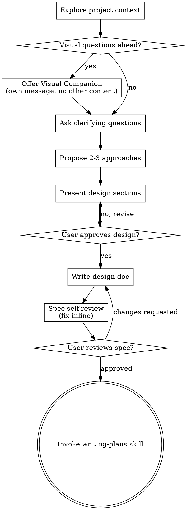

<!-- gpowers preamble (auto, four-module model) -->

# Using gpowers

You have gpowers — a unified methodology + role + tools automation distribution. There are three modules, two trigger tracks, and one naming convention you must follow.

## The three modules

- **core/** — methodology skills (TDD, debugging, planning, brainstorming, code review, etc.). Apply these automatically when they fit the task. Tag `(core)` when you reference them in replies.
- **roles/** — role-based slash commands (`/pr-review`, `/cso`, `/plan-ceo-review`, `/investigate`, ...). Do NOT invoke these yourself. **Suggest** them to the user when their input matches a role's trigger. Tag `(roles)` when you reference them.
- **tools/** — capability skills (`/ship`, `/qa`, `/canary`, `/health`, ...). Call them on demand when the task requires that capability. Tag `(tools)`.

## Dual-track triggering

- **Auto track** — `core/` only. The session-start hook injected this skill; from here, apply core methodology skills automatically when they apply. Example: bug report → invoke systematic-debugging (core). Implementation request → invoke writing-plans (core) before coding.
- **Explicit track** — `roles/`, `tools/`. Wait for the user to type the slash command. You may *suggest* one when a trigger phrase appears: "preparing to ship" → suggest `/pr-review` + `/cso` + `/qa` before `/ship`.

## Namespace tags in replies

When you reference a gpowers skill in user-facing text, append the module tag in parentheses so the user knows where it lives:

- "I'll use brainstorming (core) to walk this through."
- "Consider `/cso` (roles) for a security review."
- "I'll run /qa (tools) against the staging URL."

## Language consistency

When communicating with the user — asking questions, presenting options, explaining trade-offs, or reporting results — **output in the same language the user is writing in**. If the user writes in Chinese, reply in Chinese. If the user writes in English, reply in English. This reduces comprehension friction and ensures the user can fully understand proposals and make informed decisions.

## Skill priority

When multiple skills could apply, follow this order:
1. **Process skills first** (brainstorming, systematic-debugging, executing-plans)
2. **Implementation skills next** (writing-plans, TDD)
3. **Role / tool skills only when user-invoked** or suggested with explicit user confirmation

## Routing for overlapping skills

Three pairs are intentionally similar but serve distinct purposes. Use this table to decide:

### Debugging / investigation

| Situation | Use |
|---|---|
| Any bug, test failure, unexpected behavior — needs fixing | `systematic-debugging` (core) — auto-triggered, no output doc |
| Root-cause analysis that needs a written investigation report, or when user explicitly wants `/investigate` | `/investigate` (roles) — user-invoked, writes `$(gpowers-path project investigate)/<slug>.md` |

"Iron Law: no fixes without root cause" applies to both. The difference is outputs and invocation: `systematic-debugging` runs silently in the background of any coding session; `/investigate` is a deliberate role-based ceremony with a persisted artifact.

### Brainstorming / ideation

| Situation | Use |
|---|---|
| "I have a feature idea / how should I build X" — design-first workflow | `brainstorming` (core) — auto-triggered, leads to spec + writing-plans |
| "Is this worth building?", "validate my idea", "startup thinking", "office hours" | `/office-hours` (roles) — user-invoked, YC-style six forcing questions + Builder mode |

`brainstorming` always ends in a spec and a plan. `/office-hours` may conclude that an idea is *not* worth building — that's a valid outcome. If `office-hours` results in "yes, build it", transition to `brainstorming` to write the spec.

### Code review

| Situation | Use |
|---|---|
| After completing a task or major feature — dispatch a fresh reviewer subagent | `requesting-code-review` (core) — auto-triggered, subagent reviews your work |
| Pre-merge: comprehensive PR audit against checklist before `/ship` | `/pr-review` (roles) — user-invoked, runs full review with specialist passes |
| After receiving review feedback — deciding what to act on | `receiving-code-review` (core) — auto-triggered, structures your response to feedback |

The typical flow: code → `requesting-code-review` (core, catches issues early) → `/pr-review` (roles, gate before merge) → `receiving-code-review` (core, if reviewer pushes back).

## Reading the rest

Use the `Skill` tool (Claude Code / Codex / OpenCode), `activate_skill` (Gemini), or skill-name reference (Kimi) to load any specific skill. Skill files live under `$GPOWERS_HOME/<module>/skills/<name>/SKILL.md` — never read them by absolute path; use the platform's skill mechanism so per-platform adaptations apply.

Path queries go through `gpowers-path` (`gpowers-path config`, `gpowers-path project plans`, ...) — never concatenate `~/.gpowers/` directly in skills.

<!-- SOURCE: $GPOWERS_HOME/core/skills/brainstorming/SKILL.md -->

# Brainstorming Ideas Into Designs

Help turn ideas into fully formed designs and specs through natural collaborative dialogue.

Start by understanding the current project context, then ask questions one at a time to refine the idea. Once you understand what you're building, present the design and get user approval.

<HARD-GATE>
Do NOT invoke any implementation skill, write any code, scaffold any project, or take any implementation action until you have presented a design and the user has approved it. This applies to EVERY project regardless of perceived simplicity.
</HARD-GATE>

## Anti-Pattern: "This Is Too Simple To Need A Design"

Every project goes through this process. A todo list, a single-function utility, a config change — all of them. "Simple" projects are where unexamined assumptions cause the most wasted work. The design can be short (a few sentences for truly simple projects), but you MUST present it and get approval.

## Checklist

You MUST create a task for each of these items and complete them in order:

1. **Explore project context** — check files, docs, recent commits
2. **Offer visual companion** (if topic will involve visual questions) — this is its own message, not combined with a clarifying question. See the Visual Companion section below.
3. **Ask clarifying questions** — one at a time, understand purpose/constraints/success criteria
4. **Propose 2-3 approaches** — with trade-offs and your recommendation
5. **Present design** — in sections scaled to their complexity, get user approval after each section
6. **Write design doc** — save to `$(gpowers-path project)/designs/YYYY-MM-DD-<topic>-design.md` and commit
7. **Spec self-review** — quick inline check for placeholders, contradictions, ambiguity, scope (see below)
8. **User reviews written spec** — ask user to review the spec file before proceeding
9. **Transition to implementation** — invoke writing-plans skill to create implementation plan

## Process Flow

**The terminal state is invoking writing-plans.** Do NOT invoke frontend-design, mcp-builder, or any other implementation skill. The ONLY skill you invoke after brainstorming is writing-plans.

## The Process

**Understanding the idea:**

- Check out the current project state first (files, docs, recent commits)
- Before asking detailed questions, assess scope: if the request describes multiple independent subsystems (e.g., "build a platform with chat, file storage, billing, and analytics"), flag this immediately. Don't spend questions refining details of a project that needs to be decomposed first.
- If the project is too large for a single spec, help the user decompose into sub-projects: what are the independent pieces, how do they relate, what order should they be built? Then brainstorm the first sub-project through the normal design flow. Each sub-project gets its own spec → plan → implementation cycle.
- For appropriately-scoped projects, ask questions one at a time to refine the idea
- Prefer multiple choice questions when possible, but open-ended is fine too
- Only one question per message - if a topic needs more exploration, break it into multiple questions
- Focus on understanding: purpose, constraints, success criteria

**Exploring approaches:**

- Propose 2-3 different approaches with trade-offs
- Present options conversationally with your recommendation and reasoning
- Lead with your recommended option and explain why

**Presenting the design:**

- Once you believe you understand what you're building, present the design
- Scale each section to its complexity: a few sentences if straightforward, up to 200-300 words if nuanced
- Ask after each section whether it looks right so far
- Cover: architecture, components, data flow, error handling, testing
- Be ready to go back and clarify if something doesn't make sense

**Design document fidelity — write specs that survive implementation:**

When writing the final design document (step 6), every section must be concrete enough that an implementer can code from it without asking clarifying questions. Use this checklist:

1. **Scope In/Out** — Start with an explicit "In" and "Out" list. "Out" items are not "maybe"; they are consciously deferred with a recorded reason (e.g., "LCM alternative engine — V2, DAG complexity exceeds V1 scope").

2. **Upstream/source comparison table** — If the design ports, replaces, or learns from an existing system, include a comparison table with columns: `Aspect | Source System | Current System | Proposed`. Do not hand-wave differences (e.g., "we do the same thing"); spell out what is identical, what is adapted, and what is new.

3. **Architecture with data-flow arrows** — Use ASCII diagrams that show caller → callee relationships AND data transformation at each arrow. Add a "path-aware optimization" note when the same engine serves multiple call paths with different input shapes.

4. **Interfaces with complete type signatures** — Every exported interface, struct, and function must show:
   - Full Go/TypeScript/Rust type signatures (return types, error types, pointer vs value)
   - A one-line comment explaining the contract
   - For result structs, list every field with its purpose (e.g., `SavingsPct float64 // negative = expansion, used for anti-thrashing`)

5. **Configuration with per-path values** — If the same config struct is used by multiple call paths with different defaults, show a single struct definition AND annotate which field differs per path and why (e.g., `ThresholdPercent: 0.75 (chat) / 0.50 (agent) — agent path accumulates tool messages, so triggers earlier`).

6. **Concrete code / pseudocode for every algorithm** — Replace prose descriptions of algorithms with language-native pseudocode or Go/TypeScript code blocks. Key algorithms include: budget computation, boundary alignment, serialization, template rendering, error classification. A rule of thumb: if a section says "we do X", the next paragraph should be the `func doX(...) (...)` implementation.

7. **Call-site integration with file paths and line ranges** — For every integration point, specify:
   - File path and approximate line range
   - The exact insertion code (not "call Compress()")
   - A note on what the surrounding code does before/after the insertion

8. **Complete data samples** — Model registries, regex patterns, prompt templates, and enum mappings must be shown in full, not summarized as "~100 entries" or "similar patterns". If the list is genuinely huge, show the first 10 and the catch-all fallback, and explain the lookup priority.

9. **Layered error handling and degradation** — For each failure scenario, specify:
   - The error class (e.g., transient / auth / overflow / cancellation)
   - The immediate handling (retry, fallback, abort)
   - The degradation path (what the system does when the feature is partially broken)
   - Recovery condition (when the system returns to normal)
   Draw from mature patterns: per-error-class cooldowns, exponential backoff with jitter, panic-recover wrappers, and history-change detection during async operations.

10. **API endpoint design (if applicable)** — Any new HTTP/gRPC endpoint gets:
    - Route and method
    - Request body schema with field descriptions
    - Response body schemas per status code (200, 409, 503, ...)
    - Error response shape

11. **Risk register** — Numbered risks with: risk description, likelihood, impact, and specific mitigation (not "we will test"; say "`engine_e2e_test.go` asserts iterative-update path with previous summary present").

12. **Done criteria** — List verifiable completion steps: exact test commands that must pass, manual smoke-test scenarios with observable log lines or events, and documentation updates.

13. **Test plan with assertions** — Every test file maps to specific behavioral assertions, not just coverage areas. Example: not "boundary tests" but "`phase2_test.go` asserts: head size, tail token budget, soft ceiling 1.5×, min-3 floor, tool-pair alignment".

14. **Open questions / resolved decisions** — Record every scope decision made during brainstorming, even if the answer was "yes, include it". This prevents re-litigation during implementation.

**Design for isolation and clarity:**

- Break the system into smaller units that each have one clear purpose, communicate through well-defined interfaces, and can be understood and tested independently
- For each unit, you should be able to answer: what does it do, how do you use it, and what does it depend on?
- Can someone understand what a unit does without reading its internals? Can you change the internals without breaking consumers? If not, the boundaries need work.
- Smaller, well-bounded units are also easier for you to work with - you reason better about code you can hold in context at once, and your edits are more reliable when files are focused. When a file grows large, that's often a signal that it's doing too much.

**Working in existing codebases:**

- Explore the current structure before proposing changes. Follow existing patterns.
- Where existing code has problems that affect the work (e.g., a file that's grown too large, unclear boundaries, tangled responsibilities), include targeted improvements as part of the design - the way a good developer improves code they're working in.
- Don't propose unrelated refactoring. Stay focused on what serves the current goal.

## After the Design

**Documentation:**

- Write the validated design (spec) to `$(gpowers-path project)/designs/YYYY-MM-DD-<topic>-design.md`
  - (User preferences for spec location override this default)
- Use elements-of-style:writing-clearly-and-concisely skill if available
- Commit the design document to git

**Spec Self-Review:**
After writing the spec document, look at it with fresh eyes:

1. **Placeholder scan:** Any "TBD", "TODO", incomplete sections, or vague requirements? Fix them.
2. **Internal consistency:** Do any sections contradict each other? Does the architecture match the feature descriptions?
3. **Scope check:** Is this focused enough for a single implementation plan, or does it need decomposition?
4. **Ambiguity check:** Could any requirement be interpreted two different ways? If so, pick one and make it explicit.

Fix any issues inline. No need to re-review — just fix and move on.

**User Review Gate:**
After the spec review loop passes, ask the user to review the written spec before proceeding:

> "Spec written and committed to `<path>`. Please review it and let me know if you want to make any changes before we start writing out the implementation plan."

Wait for the user's response. If they request changes, make them and re-run the spec review loop. Only proceed once the user approves.

**Implementation:**

- Invoke the writing-plans skill to create a detailed implementation plan
- Do NOT invoke any other skill. writing-plans is the next step.

## Key Principles

- **One question at a time** - Don't overwhelm with multiple questions
- **Multiple choice preferred** - Easier to answer than open-ended when possible
- **YAGNI ruthlessly** - Remove unnecessary features from all designs
- **Explore alternatives** - Always propose 2-3 approaches before settling
- **Incremental validation** - Present design, get approval before moving on
- **Be flexible** - Go back and clarify when something doesn't make sense

## Visual Companion

A browser-based companion for showing mockups, diagrams, and visual options during brainstorming. Available as a tool — not a mode. Accepting the companion means it's available for questions that benefit from visual treatment; it does NOT mean every question goes through the browser.

**Offering the companion:** When you anticipate that upcoming questions will involve visual content (mockups, layouts, diagrams), offer it once for consent:
> "Some of what we're working on might be easier to explain if I can show it to you in a web browser. I can put together mockups, diagrams, comparisons, and other visuals as we go. This feature is still new and can be token-intensive. Want to try it? (Requires opening a local URL)"

**This offer MUST be its own message.** Do not combine it with clarifying questions, context summaries, or any other content. The message should contain ONLY the offer above and nothing else. Wait for the user's response before continuing. If they decline, proceed with text-only brainstorming.

**Per-question decision:** Even after the user accepts, decide FOR EACH QUESTION whether to use the browser or the terminal. The test: **would the user understand this better by seeing it than reading it?**

- **Use the browser** for content that IS visual — mockups, wireframes, layout comparisons, architecture diagrams, side-by-side visual designs
- **Use the terminal** for content that is text — requirements questions, conceptual choices, tradeoff lists, A/B/C/D text options, scope decisions

A question about a UI topic is not automatically a visual question. "What does personality mean in this context?" is a conceptual question — use the terminal. "Which wizard layout works better?" is a visual question — use the browser.

If they agree to the companion, read the detailed guide before proceeding:
`skills/brainstorming/visual-companion.md`
