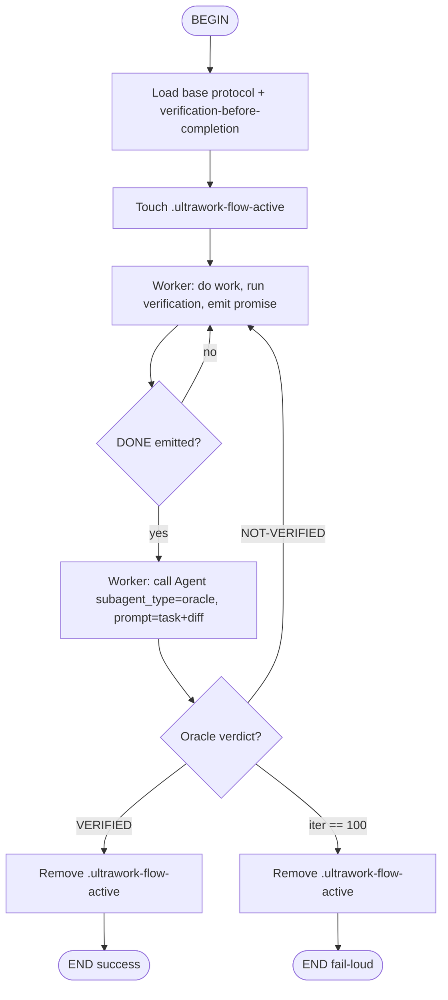

# /flow:ultrawork

Mermaid flowchart executed by Kimi Soul. This is the primary loop driver; the Stop hook is the enforcement floor.



## Flow Node Details

### BEGIN
- Soul loads this flow as the active flow.
- User task is passed as the flow argument.

### load_protocol
- Worker reads `core/skills/ultrawork/SKILL.md` (protocol section).
- Worker reads `core/skills/ultrawork/protocol.md` (tag contract).
- Worker reads `core/skills/ultrawork/oracle.md` (Oracle requirements).
- Worker activates `verification-before-completion`.

### mark_active
- `touch ${KIMI_SESSION_DIR}/.ultrawork-flow-active`
- This arms the Stop hook for this session.

### worker_iterate
- Worker performs the task: edits files, runs commands.
- Before emitting `<promise>DONE</promise>`, Worker:
  1. Runs all verification commands.
  2. Pastes full output in transcript.
  3. Confirms all green.
- If verification fails, Worker continues working (loop stays in this node).

### check_promise
- Soul checks if the last assistant message contains `<promise>DONE</promise>`.
- If not, loop continues in `worker_iterate`.
- If yes, flow proceeds to `dispatch_oracle`.

### dispatch_oracle
- Worker calls the `Agent` tool:
  ```
  Agent(subagent_type="oracle", prompt=<original task + recent diff>)
  ```
- Kimi spawns an isolated Oracle subagent per `oracle.yaml`.
- Oracle has its own Context, own wire log, and read-only tool allowlist.

### record_verdict
- Worker reads Oracle's return value.
- Worker posts Oracle's full response verbatim into its own transcript.

| Verdict | Action |
|---|---|
| `VERIFIED` | Proceed to `END_OK` |
| `NOT-VERIFIED` | Feed reason back to `worker_iterate` |
| Iteration count == 100 | Proceed to `END_FAIL` |

### END_OK
- Remove `${KIMI_SESSION_DIR}/.ultrawork-flow-active`.
- Return success summary to user.

### END_FAIL
- Remove `${KIMI_SESSION_DIR}/.ultrawork-flow-active`.
- Print iteration summary table.
- Return fail-loud message to user.

## State Files

| File | Purpose | Owner |
|---|---|---|
| `${KIMI_SESSION_DIR}/.ultrawork-flow-active` | Hook dormancy flag (active = armed) | Flow runner |
| `${KIMI_SESSION_DIR}/.ultrawork-iter` | Iteration counter | Stop hook |
| `${KIMI_SESSION_DIR}/.ultrawork-hook.log` | Hook heartbeat log | Stop hook |

No cross-session persistence in v1.
