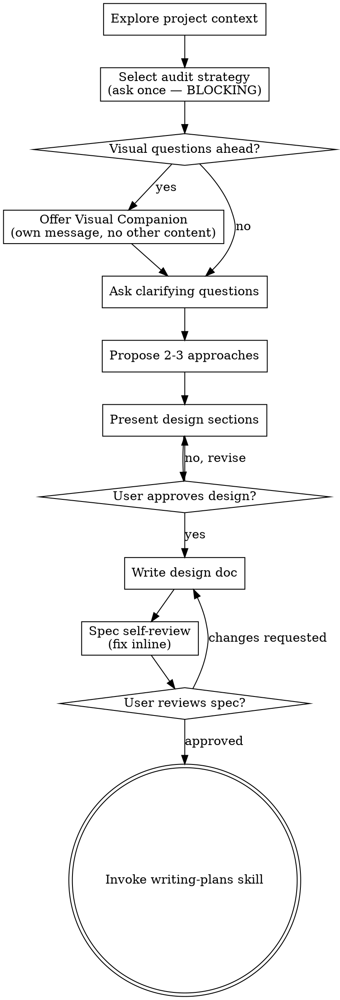

<!-- gpowers preamble (auto, four-module model) -->

# Using gpowers

You have gpowers — a unified methodology + role + tools automation distribution. There are three modules, two trigger tracks, and one naming convention you must follow.

## The three modules

- **core/** — methodology skills (TDD, debugging, planning, brainstorming, code review, etc.). Apply these automatically when they fit the task. Tag `(core)` when you reference them in replies.
- **roles/** — role-based slash commands (`/pr-review`, `/cso`, `/plan-ceo-review`, `/investigate`, ...). Do NOT invoke these yourself. **Suggest** them to the user when their input matches a role's trigger. Tag `(roles)` when you reference them.
- **tools/** — capability skills (`/ship`, `/qa`, `/canary`, `/health`, ...). Call them on demand when the task requires that capability. Tag `(tools)`.

## Dual-track triggering

- **Auto track** — `core/` only. The session-start hook injected this skill; from here, apply core methodology skills automatically when they apply. Example: bug report → invoke systematic-debugging (core). Implementation request → invoke writing-plans (core) before coding.
- **Explicit track** — `roles/`, `tools/`. Wait for the user to type the slash command. You may *suggest* one when a trigger phrase appears: "preparing to ship" → suggest `/pr-review` + `/cso` + `/qa` before `/ship`.

## Namespace tags in replies

When you reference a gpowers skill in user-facing text, append the module tag in parentheses so the user knows where it lives:

- "I'll use brainstorming (core) to walk this through."
- "Consider `/cso` (roles) for a security review."
- "I'll run /qa (tools) against the staging URL."

## Language consistency

When communicating with the user — asking questions, presenting options, explaining trade-offs, or reporting results — **output in the same language the user is writing in**. If the user writes in Chinese, reply in Chinese. If the user writes in English, reply in English. This reduces comprehension friction and ensures the user can fully understand proposals and make informed decisions.

## Skill priority

When multiple skills could apply, follow this order:
1. **Process skills first** (brainstorming, systematic-debugging, executing-plans)
2. **Implementation skills next** (writing-plans, TDD)
3. **Role / tool skills only when user-invoked** or suggested with explicit user confirmation

## Routing for overlapping skills

Three pairs are intentionally similar but serve distinct purposes. Use this table to decide:

### Debugging / investigation

| Situation | Use |
|---|---|
| Any bug, test failure, unexpected behavior — needs fixing | `systematic-debugging` (core) — auto-triggered, no output doc |
| Root-cause analysis that needs a written investigation report, or when user explicitly wants `/investigate` | `/investigate` (roles) — user-invoked, writes `$(gpowers-path project investigate)/<slug>.md` |

"Iron Law: no fixes without root cause" applies to both. The difference is outputs and invocation: `systematic-debugging` runs silently in the background of any coding session; `/investigate` is a deliberate role-based ceremony with a persisted artifact.

### Brainstorming / ideation

| Situation | Use |
|---|---|
| "I have a feature idea / how should I build X" — design-first workflow | `brainstorming` (core) — auto-triggered, leads to spec + writing-plans |
| "Is this worth building?", "validate my idea", "startup thinking", "office hours" | `/office-hours` (roles) — user-invoked, YC-style six forcing questions + Builder mode |

`brainstorming` always ends in a spec and a plan. `/office-hours` may conclude that an idea is *not* worth building — that's a valid outcome. If `office-hours` results in "yes, build it", transition to `brainstorming` to write the spec.

### Code review

| Situation | Use |
|---|---|
| After completing a task or major feature — dispatch a fresh reviewer subagent | `requesting-code-review` (core) — auto-triggered, subagent reviews your work |
| Pre-merge: comprehensive PR audit against checklist before `/ship` | `/pr-review` (roles) — user-invoked, runs full review with specialist passes |
| After receiving review feedback — deciding what to act on | `receiving-code-review` (core) — auto-triggered, structures your response to feedback |

The typical flow: code → `requesting-code-review` (core, catches issues early) → `/pr-review` (roles, gate before merge) → `receiving-code-review` (core, if reviewer pushes back).

## Reading the rest

Use the `Skill` tool (Claude Code / Codex / OpenCode), `activate_skill` (Gemini), or skill-name reference (Kimi) to load any specific skill. Skill files live under `$GPOWERS_HOME/<module>/skills/<name>/SKILL.md` — never read them by absolute path; use the platform's skill mechanism so per-platform adaptations apply.

Path queries go through `gpowers-path` (`gpowers-path config`, `gpowers-path project plans`, ...) — never concatenate `~/.gpowers/` directly in skills.

<!-- SOURCE: $GPOWERS_HOME/core/skills/brainstorming/SKILL.md -->

<!-- gpowers preamble (auto, four-module model) -->

# Using gpowers

You have gpowers — a unified methodology + role + tools automation distribution. There are three modules, two trigger tracks, and one naming convention you must follow.

## The three modules

- **core/** — methodology skills (TDD, debugging, planning, brainstorming, code review, etc.). Apply these automatically when they fit the task. Tag `(core)` when you reference them in replies.
- **roles/** — role-based slash commands (`/pr-review`, `/cso`, `/plan-ceo-review`, `/investigate`, ...). Do NOT invoke these yourself. **Suggest** them to the user when their input matches a role's trigger. Tag `(roles)` when you reference them.
- **tools/** — capability skills (`/ship`, `/qa`, `/canary`, `/health`, ...). Call them on demand when the task requires that capability. Tag `(tools)`.

## Dual-track triggering

- **Auto track** — `core/` only. The session-start hook injected this skill; from here, apply core methodology skills automatically when they apply. Example: bug report → invoke systematic-debugging (core). Implementation request → invoke writing-plans (core) before coding.
- **Explicit track** — `roles/`, `tools/`. Wait for the user to type the slash command. You may *suggest* one when a trigger phrase appears: "preparing to ship" → suggest `/pr-review` + `/cso` + `/qa` before `/ship`.

## Namespace tags in replies

When you reference a gpowers skill in user-facing text, append the module tag in parentheses so the user knows where it lives:

- "I'll use brainstorming (core) to walk this through."
- "Consider `/cso` (roles) for a security review."
- "I'll run /qa (tools) against the staging URL."

## Language consistency

When communicating with the user — asking questions, presenting options, explaining trade-offs, or reporting results — **output in the same language the user is writing in**. If the user writes in Chinese, reply in Chinese. If the user writes in English, reply in English. This reduces comprehension friction and ensures the user can fully understand proposals and make informed decisions.

## Skill priority

When multiple skills could apply, follow this order:
1. **Process skills first** (brainstorming, systematic-debugging, executing-plans)
2. **Implementation skills next** (writing-plans, TDD)
3. **Role / tool skills only when user-invoked** or suggested with explicit user confirmation

## Routing for overlapping skills

Three pairs are intentionally similar but serve distinct purposes. Use this table to decide:

### Debugging / investigation

| Situation | Use |
|---|---|
| Any bug, test failure, unexpected behavior — needs fixing | `systematic-debugging` (core) — auto-triggered, no output doc |
| Root-cause analysis that needs a written investigation report, or when user explicitly wants `/investigate` | `/investigate` (roles) — user-invoked, writes `$(gpowers-path project investigate)/<slug>.md` |

"Iron Law: no fixes without root cause" applies to both. The difference is outputs and invocation: `systematic-debugging` runs silently in the background of any coding session; `/investigate` is a deliberate role-based ceremony with a persisted artifact.

### Brainstorming / ideation

| Situation | Use |
|---|---|
| "I have a feature idea / how should I build X" — design-first workflow | `brainstorming` (core) — auto-triggered, leads to spec + writing-plans |
| "Is this worth building?", "validate my idea", "startup thinking", "office hours" | `/office-hours` (roles) — user-invoked, YC-style six forcing questions + Builder mode |

`brainstorming` always ends in a spec and a plan. `/office-hours` may conclude that an idea is *not* worth building — that's a valid outcome. If `office-hours` results in "yes, build it", transition to `brainstorming` to write the spec.

### Code review

| Situation | Use |
|---|---|
| After completing a task or major feature — dispatch a fresh reviewer subagent | `requesting-code-review` (core) — auto-triggered, subagent reviews your work |
| Pre-merge: comprehensive PR audit against checklist before `/ship` | `/pr-review` (roles) — user-invoked, runs full review with specialist passes |
| After receiving review feedback — deciding what to act on | `receiving-code-review` (core) — auto-triggered, structures your response to feedback |

The typical flow: code → `requesting-code-review` (core, catches issues early) → `/pr-review` (roles, gate before merge) → `receiving-code-review` (core, if reviewer pushes back).

## Reading the rest

Use the `Skill` tool (Claude Code / Codex / OpenCode), `activate_skill` (Gemini), or skill-name reference (Kimi) to load any specific skill. Skill files live under `$GPOWERS_HOME/<module>/skills/<name>/SKILL.md` — never read them by absolute path; use the platform's skill mechanism so per-platform adaptations apply.

Path queries go through `gpowers-path` (`gpowers-path config`, `gpowers-path project plans`, ...) — never concatenate `~/.gpowers/` directly in skills.

<!-- SOURCE: $GPOWERS_HOME/core/skills/brainstorming/SKILL.md -->

# Brainstorming Ideas Into Designs

Help turn ideas into fully formed designs and specs through natural collaborative dialogue.

Start by understanding the current project context, then ask questions one at a time to refine the idea. Once you understand what you're building, present the design and get user approval.

<HARD-GATE>
Do NOT invoke any implementation skill, write any code, scaffold any project, or take any implementation action until you have presented a design and the user has approved it. This applies to EVERY project regardless of perceived simplicity.
</HARD-GATE>

## Anti-Pattern: "This Is Too Simple To Need A Design"

Every project goes through this process. A todo list, a single-function utility, a config change — all of them. "Simple" projects are where unexamined assumptions cause the most wasted work. The design can be short (a few sentences for truly simple projects), but you MUST present it and get approval.

## Checklist

You MUST create a task for each of these items and complete them in order:

1. **Explore project context, then select the audit strategy** — this item produces TWO separate tasks; create both, and do them in this order:
   - **(1a) Explore project context** — check files, docs, recent commits. Autonomous; no user interaction.
   - **(1b) Select the audit strategy** — a BLOCKING question to the user, and its OWN task — not a side-effect of exploring, and not something you may infer. Ask once: "For this design, how deep should my assumptions be checked against your intent?" Present all three options and WAIT for an answer:
     - **Basic** — Only high-stakes assumptions (architecture, security, data, ops) are flagged for your confirmation
     - **Standard** — Every [C:INFERRED] assumption is surfaced in the User Audit Gate for your review
     - **Deep** — I ask you to confirm the key claim of every numbered section
     - Record the choice. Do NOT silently apply a default; if the user doesn't answer, ask again. Only fall back to Basic if the user explicitly declines to choose. The strategy can be upgraded mid-session (see In-session upgrade).
2. **Offer visual companion** (if topic will involve visual questions) — this is its own message, not combined with a clarifying question. See the Visual Companion section below.
3. **Extract upstream/reference feature inventory** (conditional) — If the user wants to port, adapt, or learn from an existing system (e.g., "introduce hermes-agent's design", "port X's compressor"), first confirm step 1b (audit strategy) is already recorded — if not, ask it before starting; the inventory work below is autonomous and must not carry you past that question. Then, BEFORE asking any clarifying questions you MUST:
   - Read the upstream source code or reference documentation
   - Enumerate the upstream system's complete feature/module list
   - Note which features the current codebase already has, which are missing, and which need adaptation
   - This inventory becomes your question checklist; every item must be confirmed with the user before proceeding
   - Do NOT skip this step even if the user says "just port everything" — feature parity decisions are never that simple
4. **Ask clarifying questions** — one at a time, understand purpose/constraints/success criteria. After EACH answer, immediately record the decision in a running "Resolved decisions" list (used later in the design doc). Do not batch decisions — record them as they happen.
5. **Propose 2-3 approaches** — with trade-offs and your recommendation
6. **Present design** — in sections scaled to their complexity, get user approval after each section
7. **Write design doc** — save to `$(gpowers-path project)/designs/YYYY-MM-DD-<topic>-design.md` and commit. Every section MUST carry a decision-source tag (`[C:USER]`, `[C:INFERRED]`, `[C:UPSTREAM]`, `[C:DEFERRED]`). Include a mandatory `## Assumptions & Unverified Items` chapter before the design doc is complete.
8. **Spec self-review** — quick inline check for placeholders, contradictions, ambiguity, scope (see below)
9. **User reviews written spec** — ask user to review the spec file before proceeding
10. **Transition to implementation** — invoke writing-plans skill to create implementation plan

## Process Flow

**The terminal state is invoking writing-plans.** Do NOT invoke frontend-design, mcp-builder, or any other implementation skill. The ONLY skill you invoke after brainstorming is writing-plans.

## Audit Strategy

The audit strategy controls how aggressively assumptions are surfaced to the user for confirmation. It is selected once at session start (step 1b) and can be upgraded mid-session. The strategy affects three control points: §Assumptions threshold, User Audit Gate content, and Spec self-review #5 strictness.

<HARD-GATE>
You MUST ask the user to choose Basic / Standard / Deep (step 1b) and record their answer BEFORE asking any clarifying question (step 4) or proposing approaches (step 5). Do not infer the strategy, do not silently apply a default, and do not let project exploration (step 1a) or upstream feature-inventory work (step 3) build enough momentum to carry you past this question. "Every project goes through this" applies here too — there is no "too simple to need a strategy" exemption. If you find yourself at clarifying questions or approaches without a recorded strategy, STOP and ask now.
</HARD-GATE>

### Basic

**When to use:** Most projects, and the fallback if the user explicitly declines to choose. Suitable when the user trusts the AI to handle implementation details and only wants to validate major architectural/safety decisions. Note: "fallback when the user declines" is NOT "default without asking" — you must still ask step 1b first.

**Behavior:**
- §Assumptions: Warning at >3 Medium/Low items. Spec can proceed.
- Audit Gate: Surfaces only high-stakes `[C:INFERRED]` items (architecture, security, data persistence, ops). General heuristics (token estimation defaults, common config values) are hidden.
- Spec review: Checks that `[C:USER]` and `[C:DEFERRED]` are consistent. Flags high-stakes `[C:INFERRED]` that bypassed the gate.

**Trade-off:** Fastest path to design approval. Risk: some implementation details are inferred without user confirmation.

### Standard

**When to use:** Projects involving external systems, compliance requirements, or when the user wants to see every assumption the AI made.

**Behavior:**
- §Assumptions: Warning at >1 Medium/Low item. User must explicitly accept or defer each.
- Audit Gate: Surfaces **every** `[C:INFERRED]` assumption. User must sign off on each (`[C:USER]`), defer it (`[C:DEFERRED]`), or provide a correction.
- Spec review: If any `[C:INFERRED]` was NOT presented to the user, the review FAILS.

**Trade-off:** Moderate overhead (~+1 round of interaction). Eliminates hidden assumptions.

### Deep

**When to use:** Mission-critical systems, complex migrations, or when the user wants to validate every significant design claim.

**Behavior:**
- §Assumptions: **Blocking** at any Low confidence item. Medium items require explicit user sign-off.
- Audit Gate: Confirms **every numbered section's key claim** plus all `[C:INFERRED]` assumptions. No section can have purely inferred claims.
- Spec review: Every section must have `[C:USER]` or `[C:UPSTREAM]`. Pure inference = blocking.

**Trade-off:** Highest overhead (~+2-3 rounds). Maximum confidence that the design reflects user intent.

## The Process

**Understanding the idea:**

- Check out the current project state first (files, docs, recent commits)
- Before asking detailed questions, assess scope: if the request describes multiple independent subsystems (e.g., "build a platform with chat, file storage, billing, and analytics"), flag this immediately. Don't spend questions refining details of a project that needs to be decomposed first.
- If the project is too large for a single spec, help the user decompose into sub-projects: what are the independent pieces, how do they relate, what order should they be built? Then brainstorm the first sub-project through the normal design flow. Each sub-project gets its own spec → plan → implementation cycle.
- For appropriately-scoped projects, ask questions one at a time to refine the idea
- Prefer multiple choice questions when possible, but open-ended is fine too
- Only one question per message - if a topic needs more exploration, break it into multiple questions
- Focus on understanding: purpose, constraints, success criteria

**The Seven-Dimension Decision Checklist — do not stop asking until all are covered:**

Before you can propose approaches (step 6), every dimension below must have a user-confirmed decision recorded in your "Resolved decisions" list. Use this as your hard stop condition:

| Dimension | What to confirm | Example questions |
|---|---|---|
| **Scope** | Which paths/users/scenarios are covered? What is explicitly deferred? | "V1 covers chat + agent paths. LCM alternative engine is V2." |
| **Data & State** | New data structures? Persistence layer? Lifecycle? | "Summary persisted in `workspace_chats` as synthetic row, `Include=false` soft-delete for compressed rows." |
| **Integration** | Insertion point per call path? Interaction with existing code? | "Chat path: `chat_service.go:buildRAGContext()` line ~48. Agent path: `wsconn.go` runLoop before `Stream()`." |
| **Error & Degradation** | Failure scenarios? Degradation path? Retry/cooldown strategy? | "LLM failure → tiered cooldown (30s/60s/600s). No provider → 600s. Fallback to message-count truncation." |
| **Security** | Sensitive data handling? Permission? Secret lifecycle? | "Redact applied at compression input AND output. 9 patterns covering API keys, PATs, JWTs, private keys." |
| **Observability** | Logging? Metrics? Telemetry? User-visible events? | "`mlog.Info` on chat path compression. `ws.SendEvent('context.compressed', res)` on agent path. Telemetry: `compaction_finished` with before/after tokens, retry count." |
| **Operations** | Configuration? Feature toggle? Manual intervention? Capacity planning? | "Global `context_compress_enabled` SystemSetting. Per-workspace toggle is V2. Manual `/compress` endpoint included." |

**How to use the checklist:**
- After each user answer, tag which dimension(s) it covers
- Before saying "I think I understand enough to propose approaches", scan the checklist: are all 7 dimensions confirmed?
- If a dimension is missing, ask targeted questions to fill it — do not proceed with gaps

**Exploring approaches:**

- Propose 2-3 different approaches with trade-offs
- Present options conversationally with your recommendation and reasoning
- Lead with your recommended option and explain why

**Presenting the design:**

- Once you believe you understand what you're building, present the design
- Scale each section to its complexity: a few sentences if straightforward, up to 200-300 words if nuanced
- Ask after each section whether it looks right so far
- Cover: architecture, components, data flow, error handling, testing
- Be ready to go back and clarify if something doesn't make sense

**Design document fidelity — write specs that survive implementation:**

When writing the final design document (step 6), every section must be concrete enough that an implementer can code from it without asking clarifying questions. Use this checklist:

1. **Scope In/Out** — Start with an explicit "In" and "Out" list. "Out" items are not "maybe"; they are consciously deferred with a recorded reason (e.g., "LCM alternative engine — V2, DAG complexity exceeds V1 scope").

2. **Upstream/source comparison table** — If the design ports, replaces, or learns from an existing system, include a comparison table with columns: `Aspect | Source System | Current System | Proposed`. Do not hand-wave differences (e.g., "we do the same thing"); spell out what is identical, what is adapted, and what is new.

3. **Architecture with data-flow arrows** — Use ASCII diagrams that show caller → callee relationships AND data transformation at each arrow. Add a "path-aware optimization" note when the same engine serves multiple call paths with different input shapes.

4. **Interfaces with complete type signatures** — Every exported interface, struct, and function must show:
   - Full Go/TypeScript/Rust type signatures (return types, error types, pointer vs value)
   - A one-line comment explaining the contract
   - For result structs, list every field with its purpose (e.g., `SavingsPct float64 // negative = expansion, used for anti-thrashing`)

5. **Configuration with per-path values** — If the same config struct is used by multiple call paths with different defaults, show a single struct definition AND annotate which field differs per path and why (e.g., `ThresholdPercent: 0.75 (chat) / 0.50 (agent) — agent path accumulates tool messages, so triggers earlier`).

6. **Concrete code / pseudocode for every algorithm** — Replace prose descriptions of algorithms with language-native pseudocode or Go/TypeScript code blocks. Key algorithms include: budget computation, boundary alignment, serialization, template rendering, error classification. A rule of thumb: if a section says "we do X", the next paragraph should be the `func doX(...) (...)` implementation.

7. **Call-site integration with file paths and line ranges** — For every integration point, specify:
   - File path and approximate line range
   - The exact insertion code (not "call Compress()")
   - A note on what the surrounding code does before/after the insertion

8. **Complete data samples** — Model registries, regex patterns, prompt templates, and enum mappings must be shown in full, not summarized as "~100 entries" or "similar patterns". If the list is genuinely huge, show the first 10 and the catch-all fallback, and explain the lookup priority.

9. **Layered error handling and degradation** — For each failure scenario, specify:
   - The error class (e.g., transient / auth / overflow / cancellation)
   - The immediate handling (retry, fallback, abort)
   - The degradation path (what the system does when the feature is partially broken)
   - Recovery condition (when the system returns to normal)
   Draw from mature patterns: per-error-class cooldowns, exponential backoff with jitter, panic-recover wrappers, and history-change detection during async operations.

10. **API endpoint design (if applicable)** — Any new HTTP/gRPC endpoint gets:
    - Route and method
    - Request body schema with field descriptions
    - Response body schemas per status code (200, 409, 503, ...)
    - Error response shape

11. **Risk register** — Numbered risks with: risk description, likelihood, impact, and specific mitigation (not "we will test"; say "`engine_e2e_test.go` asserts iterative-update path with previous summary present").

12. **Done criteria** — List verifiable completion steps: exact test commands that must pass, manual smoke-test scenarios with observable log lines or events, and documentation updates.

13. **Test plan with assertions** — Every test file maps to specific behavioral assertions, not just coverage areas. Example: not "boundary tests" but "`phase2_test.go` asserts: head size, tail token budget, soft ceiling 1.5×, min-3 floor, tool-pair alignment".

14. **Open questions / resolved decisions** — Record every scope decision made during brainstorming, even if the answer was "yes, include it". This prevents re-litigation during implementation.

**Design for isolation and clarity:**

- Break the system into smaller units that each have one clear purpose, communicate through well-defined interfaces, and can be understood and tested independently
- For each unit, you should be able to answer: what does it do, how do you use it, and what does it depend on?
- Can someone understand what a unit does without reading its internals? Can you change the internals without breaking consumers? If not, the boundaries need work.
- Smaller, well-bounded units are also easier for you to work with - you reason better about code you can hold in context at once, and your edits are more reliable when files are focused. When a file grows large, that's often a signal that it's doing too much.

**Working in existing codebases:**

- Explore the current structure before proposing changes. Follow existing patterns.
- Where existing code has problems that affect the work (e.g., a file that's grown too large, unclear boundaries, tangled responsibilities), include targeted improvements as part of the design - the way a good developer improves code they're working in.
- Don't propose unrelated refactoring. Stay focused on what serves the current goal.

## After the Design

**Documentation:**

- Write the validated design (spec) to `$(gpowers-path project)/designs/YYYY-MM-DD-<topic>-design.md`
  - (User preferences for spec location override this default)
- Use elements-of-style:writing-clearly-and-concisely skill if available
- Commit the design document to git

**Decision tagging requirement:**

Every section, configuration field, interface, and API endpoint in the design doc MUST carry a decision-source tag. Use these 4 tags consistently:

| Tag | Meaning | Example |
|-----|---------|---------|
| `[C:USER]` | User explicitly confirmed during clarifying questions | `[C:USER] ThresholdPercent: 0.75 (chat) / 0.50 (agent)` |
| `[C:INFERRED]` | Inferred by you from codebase analysis; must call out as "Assumption: ..." | `[C:INFERRED] CharsPerToken: 4 — standard heuristic; see §Assumptions` |
| `[C:UPSTREAM]` | Ported directly from upstream/reference without user modification | `[C:UPSTREAM] 9 secret patterns from hermes redact.py` |
| `[C:DEFERRED]` | User explicitly deferred to V2+ | `[C:DEFERRED] Per-workspace toggle — user deferred, not in V1 Config` |

**Rules:**
- Every numbered section must have at least one tag in its first paragraph.
- If a section has NO `[C:USER]` or `[C:UPSTREAM]` tags, it is entirely inference — flag it in §Assumptions.
- Do NOT mix tags inside the same sentence; tag the paragraph or bullet point.

**Assumptions & Unverified Items (mandatory chapter):**

Add a final section `## Assumptions & Unverified Items` before `## Open Questions / Resolved Decisions`. For every assumption you made to complete the design:

| # | Assumption | Confidence | Impact if Wrong | How to Verify |
|---|-----------|-----------|-----------------|---------------|
| 1 | ... | High/Medium/Low | ... | ... |

The warning threshold depends on the chosen audit strategy:

| Strategy | Warning threshold | Blocking rule |
|---|---|---|
| **Basic** | >3 Medium/Low items | Warning only; spec can proceed with explicit `[C:INFERRED]` labels |
| **Standard** | >1 Medium/Low item | Warning + user must explicitly accept or downgrade each Medium/Low item in the Audit Gate |
| **Deep** | Any Low confidence item | **Blocking** — spec is NOT ready until all Low items are verified or removed. Medium items require explicit user sign-off in the Audit Gate |

Apply the threshold that matches the recorded strategy. If the user upgrades mid-session, re-evaluate §Assumptions against the new threshold immediately.

**Spec Self-Review:**
After writing the spec document, look at it with fresh eyes:

1. **Placeholder scan:** Any "TBD", "TODO", incomplete sections, or vague requirements? Fix them.
2. **Internal consistency:** Do any sections contradict each other? Does the architecture match the feature descriptions?
3. **Scope check:** Is this focused enough for a single implementation plan, or does it need decomposition?
4. **Ambiguity check:** Could any requirement be interpreted two different ways? If so, pick one and make it explicit.
5. **Decision trace review:** Scan the "Resolved decisions" list against the design doc. The strictness depends on the audit strategy:

   **For Basic strategy:**
   - Every `[C:USER]`-tagged section must map to a confirmed decision. Missing? Ask the user or downgrade to `[C:INFERRED]`.
   - Every `[C:DEFERRED]` item must be ABSENT from the design. Found? Remove it immediately.
   - Any section with NO `[C:USER]` or `[C:UPSTREAM]` tags is inference-only — verify it is listed in §Assumptions.
   - If §Assumptions has >3 Medium/Low items: warning, but spec can proceed with explicit `[C:INFERRED]` labels.
   - Sections tagged `[C:INFERRED]` that affect architecture, security, data persistence, or ops → flag as high-stakes; these should have been surfaced in the Audit Gate.

   **For Standard strategy (everything in Basic, plus):**
   - EVERY `[C:INFERRED]` item must have been surfaced in the Audit Gate. If any `[C:INFERRED]` was NOT presented to the user, the spec self-review FAILS. Re-run the Audit Gate.
   - If §Assumptions has >1 Medium/Low item: spec is NOT ready. User must explicitly accept or downgrade each in the Audit Gate.

   **For Deep strategy (everything in Standard, plus):**
   - EVERY numbered section must have either `[C:USER]` or `[C:UPSTREAM]`. If a section has neither, it is pure inference — downgrade it or add it to §Assumptions with Low confidence.
   - Any Low confidence item in §Assumptions → **BLOCKING**. Spec is NOT ready.
   - Every section's key claim must have been confirmed by the user in the Deep Audit Gate. If any section was skipped, re-run the gate.

Fix any issues inline. No need to re-review — just fix and move on.

**User Audit Gate:**
After the spec review loop passes, present the audit summary to the user. The content depends on the chosen audit strategy:

**Basic Audit Gate:**
Present:
1. A summary of all `[C:USER]` decisions extracted (numbered list)
2. All `[C:DEFERRED]` items — ask user to confirm none are accidentally needed
3. Only **high-stakes** `[C:INFERRED]` assumptions (architecture, security, data persistence, ops) — ask user to confirm or correct each

> "Spec written and committed to `<path>`.
> 
> **Your confirmed decisions (12 items):** ...
> **Deferred to V2+ (7 items):** ... — Confirm none are needed now?
> **High-stakes assumptions requiring confirmation (3 items):**
> 1. [Assumption A] ...
> 2. [Assumption B] ...
> 
> Please confirm, correct, or request changes. If you want deeper validation of all assumptions, say 'upgrade to Standard' or 'upgrade to Deep'."

**Standard Audit Gate:**
Present:
1. All `[C:USER]` decisions (numbered list)
2. All `[C:DEFERRED]` items
3. **Every** `[C:INFERRED]` assumption — user must explicitly accept (`[C:USER]`) or defer (`[C:DEFERRED]`) each. If user provides a different value, update and re-run spec self-review.

> "Spec written and committed to `<path>`.
> 
> **Your confirmed decisions (12 items):** ...
> **Deferred to V2+ (7 items):** ...
> **[C:INFERRED] assumptions requiring your sign-off (8 items):**
> 1. [Assumption A] ... → Accept / Defer / Correct?
> 2. [Assumption B] ... → Accept / Defer / Correct?
> ...
> 
> If you want to confirm every section's key claims instead, say 'upgrade to Deep'."

**Deep Audit Gate:**
Present:
1. All `[C:USER]` decisions
2. All `[C:DEFERRED]` items
3. For **every numbered section**, extract its key claim (the single most important assertion) and ask user to confirm
4. All `[C:INFERRED]` assumptions (same as Standard)

> "Spec written and committed to `<path>`.
> 
> **Section-by-section key claim confirmation:**
> §1 Purpose: '[one-sentence summary]' — Correct?
> §4 Architecture: '[key claim]' — Correct?
> ...
> **Your confirmed decisions (12 items):** ...
> **[C:INFERRED] assumptions (8 items):** ...
> 
> Please confirm, correct, or request changes."

**Rules for all strategies:**
- If the user corrects any assumption, update the design doc, re-tag the source, and re-run spec self-review before proceeding.
- If the user upgrades the strategy mid-gate, re-generate the audit content at the new level immediately.
- Only proceed to implementation once the user approves the audit gate at the current strategy level.

**Implementation:**

- Invoke the writing-plans skill to create a detailed implementation plan
- Do NOT invoke any other skill. writing-plans is the next step.

**In-session upgrade:**

The user can upgrade the audit strategy at any time by saying:
- "upgrade to Standard" — Re-run the Audit Gate at Standard level. All `[C:INFERRED]` items must be re-surfaced for confirmation.
- "upgrade to Deep" — Re-run the Audit Gate at Deep level. Every section's key claim must be confirmed.
- "upgrade to Basic" — Downgrade is allowed but rare. Warn the user that this reduces validation coverage.

**Upgrade procedure:**
1. Record the new strategy level
2. Re-evaluate §Assumptions against the new threshold immediately
3. Re-generate the Audit Gate content at the new level
4. Re-run spec self-review #5 with the new strictness rules
5. Present the delta to the user: "Upgrading to [level] surfaces N additional items requiring your confirmation: [list]"

**Downgrade handling:**
Downgrading mid-session is generally not recommended. If the user requests it, confirm: "Downgrading to Basic means N assumptions will no longer require your confirmation. Proceed?"

## Key Principles

- **One question at a time** - Don't overwhelm with multiple questions
- **Multiple choice preferred** - Easier to answer than open-ended when possible
- **YAGNI ruthlessly** - Remove unnecessary features from all designs
- **Explore alternatives** - Always propose 2-3 approaches before settling
- **Incremental validation** - Present design, get approval before moving on
- **Be flexible** - Go back and clarify when something doesn't make sense

**Anti-premature-design guard — ask three more times before stopping:**

When you feel you have asked enough questions and are ready to propose approaches, you MUST ask yourself these three questions. If ANY of them has an answer other than "nothing, I'm fully confident", keep asking:

1. **What upstream/reference features haven't I asked about yet?** — Scan your feature inventory (step 3). Are there modules, edge cases, or configuration options from the upstream system that never came up in conversation?
2. **What complexity is hidden behind the user's "simple"?** — When the user says "just port it" or "that should be easy", dig deeper. Simple requests often mask cross-cutting concerns (two code paths with different data shapes, auth implications, state migration). Ask: "What could go wrong if we ship the simplest version?"
3. **What would an implementer still need to ask the PM after reading my design?** — Put yourself in the implementer's shoes. Look at your recorded decisions. Are there hand-waved areas ("we'll handle errors gracefully", "configure as needed") that an implementer cannot act on without clarification?

**This guard is not optional.** The quality difference between a 250-line design and a 550-line design is not writing skill — it is whether the clarifying phase captured 80% of the decisions or 20%. Do not enter the "Propose approaches" step until all three guard questions return empty.

## Visual Companion

A browser-based companion for showing mockups, diagrams, and visual options during brainstorming. Available as a tool — not a mode. Accepting the companion means it's available for questions that benefit from visual treatment; it does NOT mean every question goes through the browser.

**Offering the companion:** When you anticipate that upcoming questions will involve visual content (mockups, layouts, diagrams), offer it once for consent:
> "Some of what we're working on might be easier to explain if I can show it to you in a web browser. I can put together mockups, diagrams, comparisons, and other visuals as we go. This feature is still new and can be token-intensive. Want to try it? (Requires opening a local URL)"

**This offer MUST be its own message.** Do not combine it with clarifying questions, context summaries, or any other content. The message should contain ONLY the offer above and nothing else. Wait for the user's response before continuing. If they decline, proceed with text-only brainstorming.

**Per-question decision:** Even after the user accepts, decide FOR EACH QUESTION whether to use the browser or the terminal. The test: **would the user understand this better by seeing it than reading it?**

- **Use the browser** for content that IS visual — mockups, wireframes, layout comparisons, architecture diagrams, side-by-side visual designs
- **Use the terminal** for content that is text — requirements questions, conceptual choices, tradeoff lists, A/B/C/D text options, scope decisions

A question about a UI topic is not automatically a visual question. "What does personality mean in this context?" is a conceptual question — use the terminal. "Which wizard layout works better?" is a visual question — use the browser.

If they agree to the companion, read the detailed guide before proceeding:
`skills/brainstorming/visual-companion.md`
