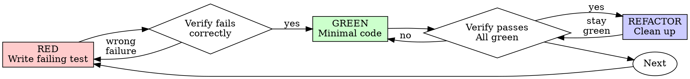

<!-- gpowers preamble (auto, four-module model) -->


# Using gpowers

You have gpowers — a unified methodology + role + tools automation distribution. There are three modules, two trigger tracks, and one naming convention you must follow.

## The three modules

- **core/** — methodology skills (TDD, debugging, planning, brainstorming, code review, etc.). Apply these automatically when they fit the task. Tag `(core)` when you reference them in replies.
- **roles/** — role-based slash commands (`/pr-review`, `/cso`, `/plan-ceo-review`, `/investigate`, ...). Do NOT invoke these yourself. **Suggest** them to the user when their input matches a role's trigger. Tag `(roles)` when you reference them.
- **tools/** — capability skills (`/ship`, `/qa`, `/canary`, `/health`, ...). Call them on demand when the task requires that capability. Tag `(tools)`.


## Dual-track triggering

- **Auto track** — `core/` only. The session-start hook injected this skill; from here, apply core methodology skills automatically when they apply. Example: bug report → invoke systematic-debugging (core). Implementation request → invoke writing-plans (core) before coding.
- **Explicit track** — `roles/`, `tools/`. Wait for the user to type the slash command. You may *suggest* one when a trigger phrase appears: "preparing to ship" → suggest `/pr-review` + `/cso` + `/qa` before `/ship`.

## Namespace tags in replies

When you reference a gpowers skill in user-facing text, append the module tag in parentheses so the user knows where it lives:

- "I'll use brainstorming (core) to walk this through."
- "Consider `/cso` (roles) for a security review."
- "I'll run /qa (tools) against the staging URL."


## Language consistency

When communicating with the user — asking questions, presenting options, explaining trade-offs, or reporting results — **output in the same language the user is writing in**. If the user writes in Chinese, reply in Chinese. If the user writes in English, reply in English. This reduces comprehension friction and ensures the user can fully understand proposals and make informed decisions.

## Skill priority

When multiple skills could apply, follow this order:
1. **Process skills first** (brainstorming, systematic-debugging, executing-plans)
2. **Implementation skills next** (writing-plans, TDD)
3. **Role / tool skills only when user-invoked** or suggested with explicit user confirmation

## Routing for overlapping skills

Three pairs are intentionally similar but serve distinct purposes. Use this table to decide:

### Debugging / investigation

| Situation | Use |
|---|---|
| Any bug, test failure, unexpected behavior — needs fixing | `systematic-debugging` (core) — auto-triggered, no output doc |
| Root-cause analysis that needs a written investigation report, or when user explicitly wants `/investigate` | `/investigate` (roles) — user-invoked, writes `$(gpowers-path project investigate)/<slug>.md` |

"Iron Law: no fixes without root cause" applies to both. The difference is outputs and invocation: `systematic-debugging` runs silently in the background of any coding session; `/investigate` is a deliberate role-based ceremony with a persisted artifact.

### Brainstorming / ideation

| Situation | Use |
|---|---|
| "I have a feature idea / how should I build X" — design-first workflow | `brainstorming` (core) — auto-triggered, leads to spec + writing-plans |
| "Is this worth building?", "validate my idea", "startup thinking", "office hours" | `/office-hours` (roles) — user-invoked, YC-style six forcing questions + Builder mode |

`brainstorming` always ends in a spec and a plan. `/office-hours` may conclude that an idea is *not* worth building — that's a valid outcome. If `office-hours` results in "yes, build it", transition to `brainstorming` to write the spec.

### Code review

| Situation | Use |
|---|---|
| After completing a task or major feature — dispatch a fresh reviewer subagent | `requesting-code-review` (core) — auto-triggered, subagent reviews your work |
| Pre-merge: comprehensive PR audit against checklist before `/ship` | `/pr-review` (roles) — user-invoked, runs full review with specialist passes |
| After receiving review feedback — deciding what to act on | `receiving-code-review` (core) — auto-triggered, structures your response to feedback |

The typical flow: code → `requesting-code-review` (core, catches issues early) → `/pr-review` (roles, gate before merge) → `receiving-code-review` (core, if reviewer pushes back).

## Reading the rest

Use the `Skill` tool (Claude Code / Codex / OpenCode), `activate_skill` (Gemini), or skill-name reference (Kimi) to load any specific skill. Skill files live under `$GPOWERS_HOME/<module>/skills/<name>/SKILL.md` — never read them by absolute path; use the platform's skill mechanism so per-platform adaptations apply.

Path queries go through `gpowers-path` (`gpowers-path config`, `gpowers-path project plans`, ...) — never concatenate `~/.gpowers/` directly in skills.

<!-- SOURCE: $GPOWERS_HOME/core/skills/test-driven-development/SKILL.md -->


# Test-Driven Development (TDD)

## Overview

Write the test first. Watch it fail. Write minimal code to pass.

**Core principle:** If you didn't watch the test fail, you don't know if it tests the right thing.

**Violating the letter of the rules is violating the spirit of the rules.**

## When to Use

**Always:**
- New features
- Bug fixes
- Refactoring
- Behavior changes

**Exceptions (ask your human partner):**
- Throwaway prototypes
- Generated code
- Configuration files

Thinking "skip TDD just this once"? Stop. That's rationalization.

## The Iron Law

```
NO PRODUCTION CODE WITHOUT A FAILING TEST FIRST
```

Write code before the test? Delete it. Start over.

**No exceptions:**
- Don't keep it as "reference"
- Don't "adapt" it while writing tests
- Don't look at it
- Delete means delete

Implement fresh from tests. Period.

## Red-Green-Refactor



### RED - Write Failing Test

Write one minimal test showing what should happen.

<Good>
```typescript
test('retries failed operations 3 times', async () => {
  let attempts = 0;
  const operation = () => {
    attempts++;
    if (attempts < 3) throw new Error('fail');
    return 'success';
  };

  const result = await retryOperation(operation);

  expect(result).toBe('success');
  expect(attempts).toBe(3);
});
```
Clear name, tests real behavior, one thing
</Good>

<Bad>
```typescript
test('retry works', async () => {
  const mock = jest.fn()
    .mockRejectedValueOnce(new Error())
    .mockRejectedValueOnce(new Error())
    .mockResolvedValueOnce('success');
  await retryOperation(mock);
  expect(mock).toHaveBeenCalledTimes(3);
});
```
Vague name, tests mock not code
</Bad>

**Requirements:**
- One behavior
- Clear name
- Real code (no mocks unless unavoidable)

### Verify RED - Watch It Fail

**MANDATORY. Never skip.**

```bash
npm test path/to/test.test.ts
```

Confirm:
- Test fails (not errors)
- Failure message is expected
- Fails because feature missing (not typos)

**Test passes?** You're testing existing behavior. Fix test.

**Test errors?** Fix error, re-run until it fails correctly.

### GREEN - Minimal Code

Write simplest code to pass the test.

<Good>
```typescript
async function retryOperation<T>(fn: () => Promise<T>): Promise<T> {
  for (let i = 0; i < 3; i++) {
    try {
      return await fn();
    } catch (e) {
      if (i === 2) throw e;
    }
  }
  throw new Error('unreachable');
}
```
Just enough to pass
</Good>

<Bad>
```typescript
async function retryOperation<T>(
  fn: () => Promise<T>,
  options?: {
    maxRetries?: number;
    backoff?: 'linear' | 'exponential';
    onRetry?: (attempt: number) => void;
  }
): Promise<T> {
  // YAGNI
}
```
Over-engineered
</Bad>

Don't add features, refactor other code, or "improve" beyond the test.

### Verify GREEN - Watch It Pass

**MANDATORY.**

```bash
npm test path/to/test.test.ts
```

Confirm:
- Test passes
- Other tests still pass
- Output pristine (no errors, warnings)

**Test fails?** Fix code, not test.

**Other tests fail?** Fix now.

### REFACTOR - Clean Up

After green only:
- Remove duplication
- Improve names
- Extract helpers

Keep tests green. Don't add behavior.

### Repeat

Next failing test for next feature.

## Good Tests

| Quality | Good | Bad |
|---------|------|-----|
| **Minimal** | One thing. "and" in name? Split it. | `test('validates email and domain and whitespace')` |
| **Clear** | Name describes behavior | `test('test1')` |
| **Shows intent** | Demonstrates desired API | Obscures what code should do |

## Why Order Matters

**"I'll write tests after to verify it works"**

Tests written after code pass immediately. Passing immediately proves nothing:
- Might test wrong thing
- Might test implementation, not behavior
- Might miss edge cases you forgot
- You never saw it catch the bug

Test-first forces you to see the test fail, proving it actually tests something.

**"I already manually tested all the edge cases"**

Manual testing is ad-hoc. You think you tested everything but:
- No record of what you tested
- Can't re-run when code changes
- Easy to forget cases under pressure
- "It worked when I tried it" ≠ comprehensive

Automated tests are systematic. They run the same way every time.

**"Deleting X hours of work is wasteful"**

Sunk cost fallacy. The time is already gone. Your choice now:
- Delete and rewrite with TDD (X more hours, high confidence)
- Keep it and add tests after (30 min, low confidence, likely bugs)

The "waste" is keeping code you can't trust. Working code without real tests is technical debt.

**"TDD is dogmatic, being pragmatic means adapting"**

TDD IS pragmatic:
- Finds bugs before commit (faster than debugging after)
- Prevents regressions (tests catch breaks immediately)
- Documents behavior (tests show how to use code)
- Enables refactoring (change freely, tests catch breaks)

"Pragmatic" shortcuts = debugging in production = slower.

**"Tests after achieve the same goals - it's spirit not ritual"**

No. Tests-after answer "What does this do?" Tests-first answer "What should this do?"

Tests-after are biased by your implementation. You test what you built, not what's required. You verify remembered edge cases, not discovered ones.

Tests-first force edge case discovery before implementing. Tests-after verify you remembered everything (you didn't).

30 minutes of tests after ≠ TDD. You get coverage, lose proof tests work.

## Common Rationalizations

| Excuse | Reality |
|--------|---------|
| "Too simple to test" | Simple code breaks. Test takes 30 seconds. |
| "I'll test after" | Tests passing immediately prove nothing. |
| "Tests after achieve same goals" | Tests-after = "what does this do?" Tests-first = "what should this do?" |
| "Already manually tested" | Ad-hoc ≠ systematic. No record, can't re-run. |
| "Deleting X hours is wasteful" | Sunk cost fallacy. Keeping unverified code is technical debt. |
| "Keep as reference, write tests first" | You'll adapt it. That's testing after. Delete means delete. |
| "Need to explore first" | Fine. Throw away exploration, start with TDD. |
| "Test hard = design unclear" | Listen to test. Hard to test = hard to use. |
| "TDD will slow me down" | TDD faster than debugging. Pragmatic = test-first. |
| "Manual test faster" | Manual doesn't prove edge cases. You'll re-test every change. |
| "Existing code has no tests" | You're improving it. Add tests for existing code. |

## Red Flags - STOP and Start Over

- Code before test
- Test after implementation
- Test passes immediately
- Can't explain why test failed
- Tests added "later"
- Rationalizing "just this once"
- "I already manually tested it"
- "Tests after achieve the same purpose"
- "It's about spirit not ritual"
- "Keep as reference" or "adapt existing code"
- "Already spent X hours, deleting is wasteful"
- "TDD is dogmatic, I'm being pragmatic"
- "This is different because..."

**All of these mean: Delete code. Start over with TDD.**

## Example: Bug Fix

**Bug:** Empty email accepted

**RED**
```typescript
test('rejects empty email', async () => {
  const result = await submitForm({ email: '' });
  expect(result.error).toBe('Email required');
});
```

**Verify RED**
```bash
$ npm test
FAIL: expected 'Email required', got undefined
```

**GREEN**
```typescript
function submitForm(data: FormData) {
  if (!data.email?.trim()) {
    return { error: 'Email required' };
  }
  // ...
}
```

**Verify GREEN**
```bash
$ npm test
PASS
```

**REFACTOR**
Extract validation for multiple fields if needed.

## Verification Checklist

Before marking work complete:

- [ ] Every new function/method has a test
- [ ] Watched each test fail before implementing
- [ ] Each test failed for expected reason (feature missing, not typo)
- [ ] Wrote minimal code to pass each test
- [ ] All tests pass
- [ ] Output pristine (no errors, warnings)
- [ ] Tests use real code (mocks only if unavoidable)
- [ ] Edge cases and errors covered

Can't check all boxes? You skipped TDD. Start over.

## When Stuck

| Problem | Solution |
|---------|----------|
| Don't know how to test | Write wished-for API. Write assertion first. Ask your human partner. |
| Test too complicated | Design too complicated. Simplify interface. |
| Must mock everything | Code too coupled. Use dependency injection. |
| Test setup huge | Extract helpers. Still complex? Simplify design. |

## Debugging Integration

Bug found? Write failing test reproducing it. Follow TDD cycle. Test proves fix and prevents regression.

Never fix bugs without a test.

## Testing Anti-Patterns

When adding mocks or test utilities, read @testing-anti-patterns.md to avoid common pitfalls:
- Testing mock behavior instead of real behavior
- Adding test-only methods to production classes
- Mocking without understanding dependencies

## Final Rule

```
Production code → test exists and failed first
Otherwise → not TDD
```

No exceptions without your human partner's permission.
