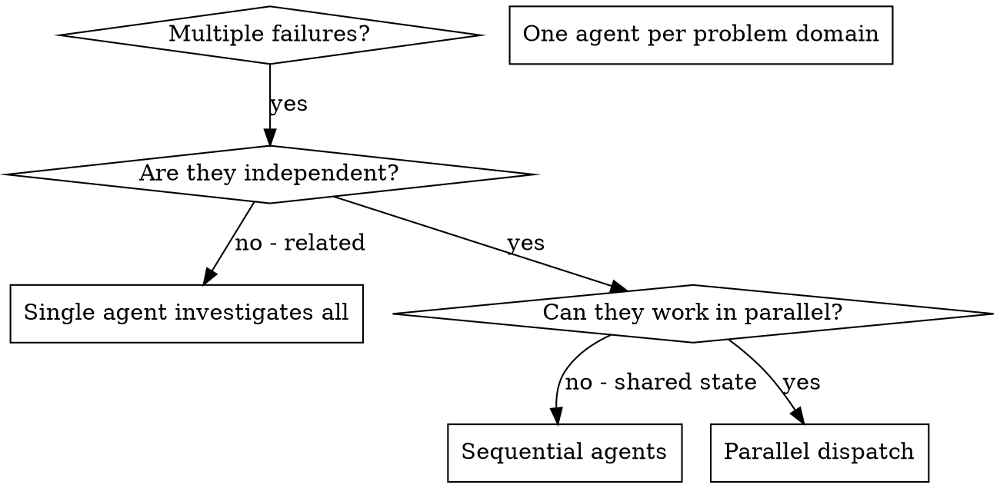

<!-- gpowers preamble (auto, four-module model) -->


# Using gpowers

You have gpowers — a unified methodology + role + tools + business automation distribution. There are four modules, two trigger tracks, and one naming convention you must follow.

## The four modules

- **core/** — methodology skills (TDD, debugging, planning, brainstorming, code review, etc.). Apply these automatically when they fit the task. Tag `(core)` when you reference them in replies.
- **roles/** — role-based slash commands (`/pr-review`, `/cso`, `/plan-ceo-review`, `/investigate`, ...). Do NOT invoke these yourself. **Suggest** them to the user when their input matches a role's trigger. Tag `(roles)` when you reference them.
- **tools/** — capability skills (`/ship`, `/qa`, `/canary`, `/health`, ...). Call them on demand when the task requires that capability. Tag `(tools)`.
- **business/** — optional commercial automation (`/money`, `/money-content`, ...). Only present if installed with `--with-business`. Tag `(business)`.

## Dual-track triggering

- **Auto track** — `core/` only. The session-start hook injected this skill; from here, apply core methodology skills automatically when they apply. Example: bug report → invoke systematic-debugging (core). Implementation request → invoke writing-plans (core) before coding.
- **Explicit track** — `roles/`, `tools/`, `business/`. Wait for the user to type the slash command. You may *suggest* one when a trigger phrase appears: "preparing to ship" → suggest `/pr-review` + `/cso` + `/qa` before `/ship`.

## Namespace tags in replies

When you reference a gpowers skill in user-facing text, append the module tag in parentheses so the user knows where it lives:

- "I'll use brainstorming (core) to walk this through."
- "Consider `/cso` (roles) for a security review."
- "I'll run /qa (tools) against the staging URL."
- "money-content (business) covers that workflow."

## Language consistency

When communicating with the user — asking questions, presenting options, explaining trade-offs, or reporting results — **output in the same language the user is writing in**. If the user writes in Chinese, reply in Chinese. If the user writes in English, reply in English. This reduces comprehension friction and ensures the user can fully understand proposals and make informed decisions.

## Skill priority

When multiple skills could apply, follow this order:
1. **Process skills first** (brainstorming, systematic-debugging, executing-plans)
2. **Implementation skills next** (writing-plans, TDD)
3. **Role / tool skills only when user-invoked** or suggested with explicit user confirmation

## Routing for overlapping skills

Three pairs are intentionally similar but serve distinct purposes. Use this table to decide:

### Debugging / investigation

| Situation | Use |
|---|---|
| Any bug, test failure, unexpected behavior — needs fixing | `systematic-debugging` (core) — auto-triggered, no output doc |
| Root-cause analysis that needs a written investigation report, or when user explicitly wants `/investigate` | `/investigate` (roles) — user-invoked, writes `$(gpowers-path project investigate)/<slug>.md` |

"Iron Law: no fixes without root cause" applies to both. The difference is outputs and invocation: `systematic-debugging` runs silently in the background of any coding session; `/investigate` is a deliberate role-based ceremony with a persisted artifact.

### Brainstorming / ideation

| Situation | Use |
|---|---|
| "I have a feature idea / how should I build X" — design-first workflow | `brainstorming` (core) — auto-triggered, leads to spec + writing-plans |
| "Is this worth building?", "validate my idea", "startup thinking", "office hours" | `/office-hours` (roles) — user-invoked, YC-style six forcing questions + Builder mode |

`brainstorming` always ends in a spec and a plan. `/office-hours` may conclude that an idea is *not* worth building — that's a valid outcome. If `office-hours` results in "yes, build it", transition to `brainstorming` to write the spec.

### Code review

| Situation | Use |
|---|---|
| After completing a task or major feature — dispatch a fresh reviewer subagent | `requesting-code-review` (core) — auto-triggered, subagent reviews your work |
| Pre-merge: comprehensive PR audit against checklist before `/ship` | `/pr-review` (roles) — user-invoked, runs full review with specialist passes |
| After receiving review feedback — deciding what to act on | `receiving-code-review` (core) — auto-triggered, structures your response to feedback |

The typical flow: code → `requesting-code-review` (core, catches issues early) → `/pr-review` (roles, gate before merge) → `receiving-code-review` (core, if reviewer pushes back).

## Reading the rest

Use the `Skill` tool (Claude Code / Codex / OpenCode), `activate_skill` (Gemini), or skill-name reference (Kimi) to load any specific skill. Skill files live under `$GPOWERS_HOME/<module>/skills/<name>/SKILL.md` — never read them by absolute path; use the platform's skill mechanism so per-platform adaptations apply.

Path queries go through `gpowers-path` (`gpowers-path config`, `gpowers-path project plans`, ...) — never concatenate `~/.gpowers/` directly in skills.

<!-- SOURCE: $GPOWERS_HOME/core/skills/dispatching-parallel-agents/SKILL.md -->


# Dispatching Parallel Agents

## Overview

You delegate tasks to specialized agents with isolated context. By precisely crafting their instructions and context, you ensure they stay focused and succeed at their task. They should never inherit your session's context or history — you construct exactly what they need. This also preserves your own context for coordination work.

When you have multiple unrelated failures (different test files, different subsystems, different bugs), investigating them sequentially wastes time. Each investigation is independent and can happen in parallel.

**Core principle:** Dispatch one agent per independent problem domain. Let them work concurrently.

## When to Use



**Use when:**
- 3+ test files failing with different root causes
- Multiple subsystems broken independently
- Each problem can be understood without context from others
- No shared state between investigations

**Don't use when:**
- Failures are related (fix one might fix others)
- Need to understand full system state
- Agents would interfere with each other

## The Pattern

### 1. Identify Independent Domains

Group failures by what's broken:
- File A tests: Tool approval flow
- File B tests: Batch completion behavior
- File C tests: Abort functionality

Each domain is independent - fixing tool approval doesn't affect abort tests.

### 2. Create Focused Agent Tasks

Each agent gets:
- **Specific scope:** One test file or subsystem
- **Clear goal:** Make these tests pass
- **Constraints:** Don't change other code
- **Expected output:** Summary of what you found and fixed

### 3. Dispatch in Parallel

```typescript
// In Claude Code / AI environment
Task("Fix agent-tool-abort.test.ts failures")
Task("Fix batch-completion-behavior.test.ts failures")
Task("Fix tool-approval-race-conditions.test.ts failures")
// All three run concurrently
```

### 4. Review and Integrate

When agents return:
- Read each summary
- Verify fixes don't conflict
- Run full test suite
- Integrate all changes

## Agent Prompt Structure

Good agent prompts are:
1. **Focused** - One clear problem domain
2. **Self-contained** - All context needed to understand the problem
3. **Specific about output** - What should the agent return?

```markdown
Fix the 3 failing tests in src/agents/agent-tool-abort.test.ts:

1. "should abort tool with partial output capture" - expects 'interrupted at' in message
2. "should handle mixed completed and aborted tools" - fast tool aborted instead of completed
3. "should properly track pendingToolCount" - expects 3 results but gets 0

These are timing/race condition issues. Your task:

1. Read the test file and understand what each test verifies
2. Identify root cause - timing issues or actual bugs?
3. Fix by:
   - Replacing arbitrary timeouts with event-based waiting
   - Fixing bugs in abort implementation if found
   - Adjusting test expectations if testing changed behavior

Do NOT just increase timeouts - find the real issue.

Return: Summary of what you found and what you fixed.
```

## Common Mistakes

**❌ Too broad:** "Fix all the tests" - agent gets lost
**✅ Specific:** "Fix agent-tool-abort.test.ts" - focused scope

**❌ No context:** "Fix the race condition" - agent doesn't know where
**✅ Context:** Paste the error messages and test names

**❌ No constraints:** Agent might refactor everything
**✅ Constraints:** "Do NOT change production code" or "Fix tests only"

**❌ Vague output:** "Fix it" - you don't know what changed
**✅ Specific:** "Return summary of root cause and changes"

## When NOT to Use

**Related failures:** Fixing one might fix others - investigate together first
**Need full context:** Understanding requires seeing entire system
**Exploratory debugging:** You don't know what's broken yet
**Shared state:** Agents would interfere (editing same files, using same resources)

## Real Example from Session

**Scenario:** 6 test failures across 3 files after major refactoring

**Failures:**
- agent-tool-abort.test.ts: 3 failures (timing issues)
- batch-completion-behavior.test.ts: 2 failures (tools not executing)
- tool-approval-race-conditions.test.ts: 1 failure (execution count = 0)

**Decision:** Independent domains - abort logic separate from batch completion separate from race conditions

**Dispatch:**
```
Agent 1 → Fix agent-tool-abort.test.ts
Agent 2 → Fix batch-completion-behavior.test.ts
Agent 3 → Fix tool-approval-race-conditions.test.ts
```

**Results:**
- Agent 1: Replaced timeouts with event-based waiting
- Agent 2: Fixed event structure bug (threadId in wrong place)
- Agent 3: Added wait for async tool execution to complete

**Integration:** All fixes independent, no conflicts, full suite green

**Time saved:** 3 problems solved in parallel vs sequentially

## Key Benefits

1. **Parallelization** - Multiple investigations happen simultaneously
2. **Focus** - Each agent has narrow scope, less context to track
3. **Independence** - Agents don't interfere with each other
4. **Speed** - 3 problems solved in time of 1

## Verification

After agents return:
1. **Review each summary** - Understand what changed
2. **Check for conflicts** - Did agents edit same code?
3. **Run full suite** - Verify all fixes work together
4. **Spot check** - Agents can make systematic errors

## Real-World Impact

From debugging session (2025-10-03):
- 6 failures across 3 files
- 3 agents dispatched in parallel
- All investigations completed concurrently
- All fixes integrated successfully
- Zero conflicts between agent changes
